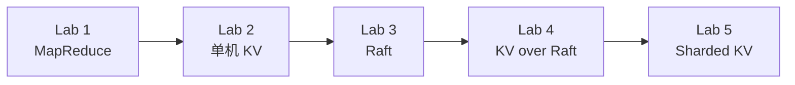
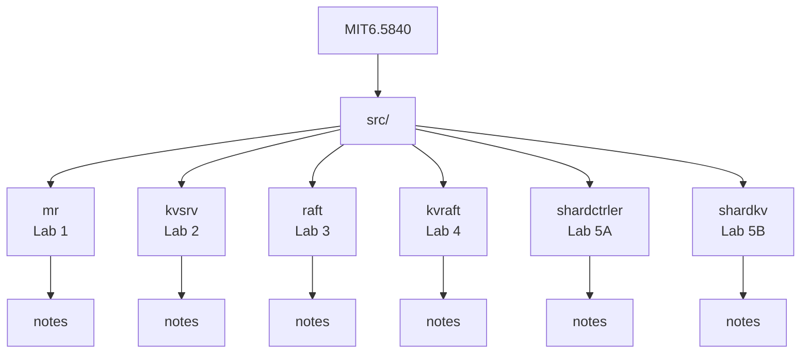
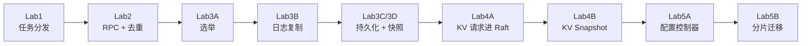
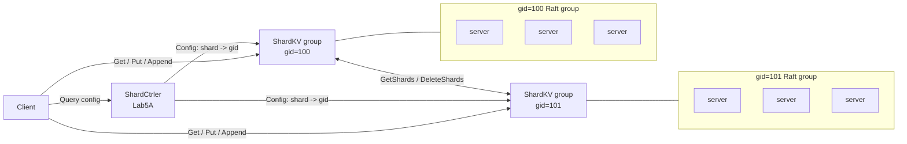

# MIT 6.5840 Labs

本仓库是 MIT 6.5840 分布式系统课程实验实现，代码骨架来自 `6.5840-golabs-2024`。当前实现覆盖 MapReduce、KV Server、Raft、KV over Raft，以及经典 `shardctrler + shardkv` 分片 KV 架构。

## 文档定位

文档组织参考 [casey-li/MIT6.5840](https://github.com/casey-li/MIT6.5840) 这种按 Lab 记录理解、实现思路、踩坑和验证经验的方式；本仓库在此基础上更偏向“当前代码走读”：每个 Lab 尽量说明核心对象、RPC/Raft 链路、状态变化、容易混淆的边界和测试入口。

这些笔记不是课程官方说明，也不是完整论文翻译，而是给自己复盘实现和排查 bug 用的工程笔记。测试通过只能说明覆盖了当前测试场景，分布式系统里的超时、乱序、重启和分区组合仍然需要结合代码继续检查。



## 怎么读

先看每篇开头的主线说明和“先抓重点”，再看流程图，最后再看代码入口。不要一上来就钻所有字段，先把“谁发请求、请求进不进 Raft、状态怎么变”串起来。

## 快速入口

- [Lab1 MapReduce 核心操作](src/mr/notes/lab1-mapreduce-core-operations.md)
- [Lab2 KVServer 核心操作](src/kvsrv/notes/lab2-kvsrv-core-operations.md)
- [Lab3A Raft 选举与心跳](src/raft/notes/lab3a-election-and-heartbeat.md)
- [Lab3B Raft 日志复制与提交](src/raft/notes/lab3b-log-replication.md)
- [Lab3C/3D Raft 持久化与快照](src/raft/notes/lab3c3d-persistence-and-snapshot.md)
- [Lab4A KVRaft 核心请求链路](src/kvraft/notes/lab4a-kvraft-core-operations.md)
- [Lab4B KVRaft Snapshot 与恢复](src/kvraft/notes/lab4b-kvraft-snapshot-recovery.md)
- [Lab5A ShardCtrler 核心操作](src/shardctrler/notes/lab5a-shardctrler.md)
- [Lab5B ShardKV 角色与操作表](src/shardkv/notes/lab5b-roles-and-operations.md)
- [常用测试命令](#常用测试命令)
- [目录结构](#目录结构)

## 版本说明

这个仓库使用的是经典 6.5840/6.824 风格实验骨架，和 2026 课程网页上的新骨架不完全一致：

- 当前 Lab 2 是 `Get/Put/Append` 单机 KV 服务；2026 Lab 2 是带 `version` 的 KV server。
- 当前 Lab 4 是直接基于 `Raft` 实现 `kvraft`；2026 Lab 4 先实现通用 `rsm`。
- 当前 Lab 5 是 `shardctrler + shardkv`；2026 Lab 5 使用 `shardctrler`、`shardgrp`、`shardkv1` 等新结构。

如果要严格对照课程提交，请以你当年的 schedule 和 lab 页面为准。

## 目录结构



| 路径 | 内容 |
| --- | --- |
| `src/mr/` | Lab 1 MapReduce |
| `src/kvsrv/` | Lab 2 单机 KV Server |
| `src/raft/` | Lab 3 Raft |
| `src/kvraft/` | Lab 4 Fault-tolerant KV |
| `src/shardctrler/` | Lab 5A ShardCtrler |
| `src/shardkv/` | Lab 5B ShardKV |
| `src/*/notes/` | 实验笔记和图解 |
| `src/*/test_result/` | 已保存的部分测试记录 |

## Lab 总览

| Lab | 当前状态 | 主要代码 | 说明 |
| --- | --- | --- | --- |
| Lab 1: MapReduce | 已完成 | `src/mr/` | Coordinator 分配 Map/Reduce 任务，Worker 执行并生成中间文件和最终输出。 |
| Lab 2: Key/Value Server | 已完成 | `src/kvsrv/` | 单机 `Get/Put/Append`，通过唯一请求 ID 避免重复写。 |
| Lab 3: Raft | 已完成 3A-3D | `src/raft/` | leader election、日志复制、持久化、snapshot。 |
| Lab 4: Fault-tolerant KV | 已完成 | `src/kvraft/` | KV 请求进入 Raft，支持去重和 snapshot。 |
| Lab 5: Sharded KV | 已完成 5A/5B | `src/shardctrler/`、`src/shardkv/` | ShardCtrler 管配置，ShardKV 负责分片迁移和服务请求。 |

## 学习路线



| Lab | 主题 | 推荐阅读 |
| --- | --- | --- |
| Lab 1 | MapReduce | [Lab1 MapReduce 核心操作](src/mr/notes/lab1-mapreduce-core-operations.md) |
| Lab 2 | 单机 KV Server | [Lab2 KVServer 核心操作](src/kvsrv/notes/lab2-kvsrv-core-operations.md) |
| Lab 3A | Raft 选举与心跳 | [Lab3A Raft 选举与心跳](src/raft/notes/lab3a-election-and-heartbeat.md) |
| Lab 3B | Raft 日志复制与提交 | [Lab3B Raft 日志复制与提交](src/raft/notes/lab3b-log-replication.md) |
| Lab 3C/3D | Raft 持久化与快照 | [Lab3C/3D Raft 持久化与快照](src/raft/notes/lab3c3d-persistence-and-snapshot.md) |
| Lab 4A | KV over Raft | [Lab4A KVRaft 核心请求链路](src/kvraft/notes/lab4a-kvraft-core-operations.md) |
| Lab 4B | KVRaft Snapshot | [Lab4B KVRaft Snapshot 与恢复](src/kvraft/notes/lab4b-kvraft-snapshot-recovery.md) |
| Lab 5A | ShardCtrler | [Lab5A ShardCtrler 核心操作](src/shardctrler/notes/lab5a-shardctrler.md) |
| Lab 5B | ShardKV | [Lab5B ShardKV 角色与操作表](src/shardkv/notes/lab5b-roles-and-operations.md) |

## 各 Lab 简述

### Lab 1: MapReduce

实现简化版 MapReduce 框架。`coordinator.go` 维护任务状态并处理超时重试；`worker.go` 执行 Map/Reduce 逻辑，生成 `mr-X-Y` 中间文件和 `mr-out-X` 输出文件。

详细图解见 [Lab1 MapReduce 核心操作](src/mr/notes/lab1-mapreduce-core-operations.md)。

### Lab 2: Key/Value Server

实现单机 KV 服务。服务端用内存 map 保存数据，并通过唯一请求 ID 过滤重复 `Put/Append` 请求。

详细图解见 [Lab2 KVServer 核心操作](src/kvsrv/notes/lab2-kvsrv-core-operations.md)。

### Lab 3: Raft

实现 Raft 共识模块，包括选举、日志复制、持久化和快照。已有部分循环测试记录保存在 `src/raft/test_result/`。

详细图解见：

- [Lab3A Raft 选举与心跳](src/raft/notes/lab3a-election-and-heartbeat.md)
- [Lab3B Raft 日志复制与提交](src/raft/notes/lab3b-log-replication.md)
- [Lab3C/3D Raft 持久化与快照](src/raft/notes/lab3c3d-persistence-and-snapshot.md)

### Lab 4: Fault-tolerant Key/Value Service

在 Raft 上实现容错 KV 服务。客户端请求由 leader 提交到 Raft，提交后应用到状态机；当 Raft 日志过大时生成 snapshot。

详细图解见：

- [Lab4A KVRaft 核心请求链路](src/kvraft/notes/lab4a-kvraft-core-operations.md)
- [Lab4B KVRaft Snapshot 与恢复](src/kvraft/notes/lab4b-kvraft-snapshot-recovery.md)

### Lab 5: Sharded Key/Value Service

实现经典分片 KV 架构：

- ShardCtrler 维护配置历史，决定固定数量 shard 分别属于哪个 replica group。
- ShardKV group 内部是一组 Raft server，负责复制并服务自己名下的 shard。
- 配置变化后，ShardKV 根据 `lastConfig/currentConfig` 判断 shard 迁入和迁出，并执行拉取、GC 和状态收尾。



详细图解见：

- [Lab5A ShardCtrler 核心操作](src/shardctrler/notes/lab5a-shardctrler.md)
- [Lab5B ShardKV 角色与操作表](src/shardkv/notes/lab5b-roles-and-operations.md)

## 常用测试命令

```bash
# Lab 1
cd src/main
bash test-mr.sh

# Lab 2
cd src/kvsrv
go test

# Lab 3
cd src/raft
go test -run 3A
go test -run 3B
go test -run 3C
go test -run 3D

# Lab 4
cd src/kvraft
go test -run 4A -race
go test -run 4B -race

# Lab 5A
cd src/shardctrler
go test

# Lab 5B
cd src/shardkv
go test -run 5A
go test -run 5B -count=1 -timeout 600s
```
