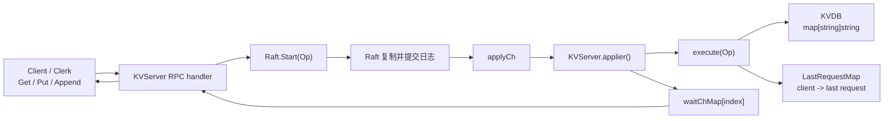
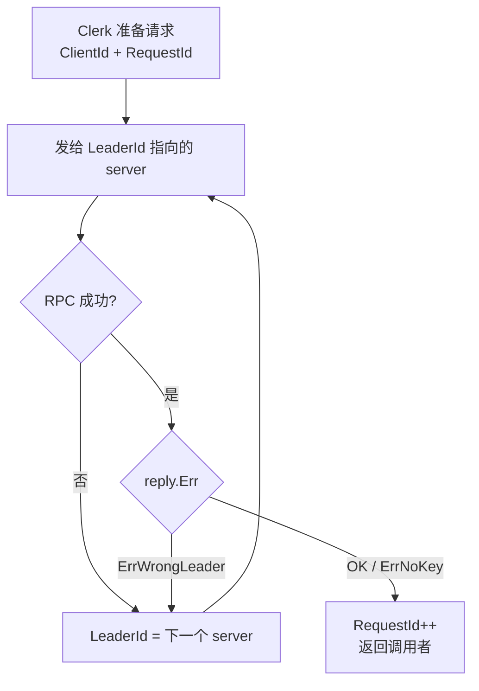
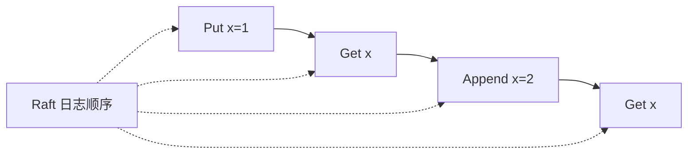
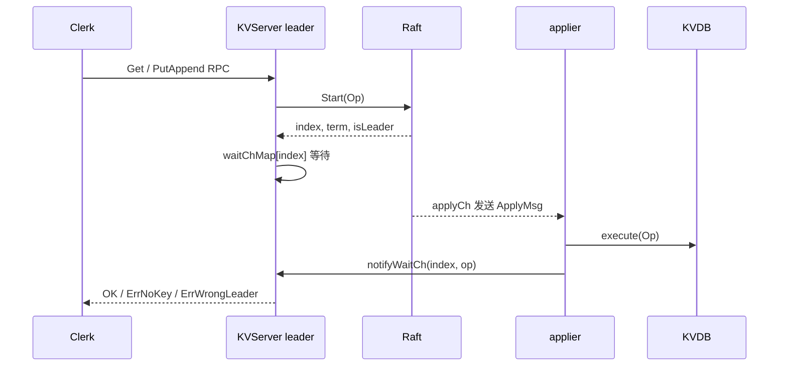
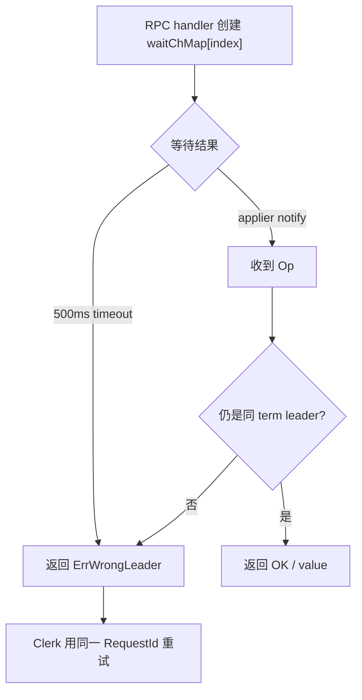
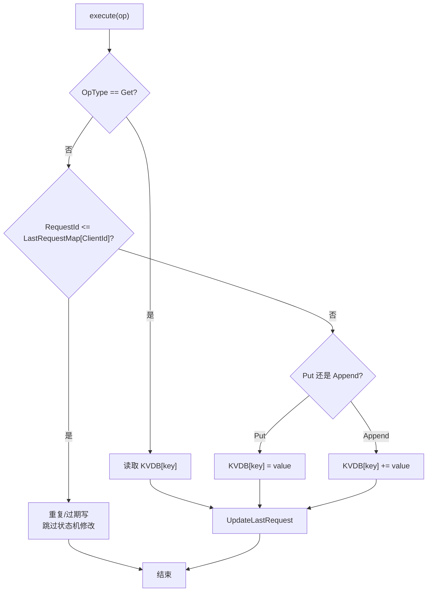
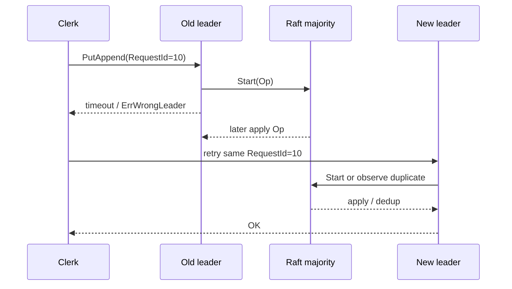

# Lab4A KVRaft 核心请求链路

一句话主线：

```text
Client 发 Get/Put/Append -> KVServer leader 提交 Raft -> Raft commit -> KVServer apply 到 KVDB -> 唤醒 RPC handler 返回 Client
```

Lab4A 的目标不是实现新的存储引擎，而是把一个普通内存 KV 状态机放到 Raft 日志后面。所有副本只要按照同一条 Raft 日志顺序执行 `Get`、`Put`、`Append`，就能得到同样的状态机结果。

## 先抓重点

- Client 只和 KVServer RPC 层交互，不直接操作 Raft。
- KVServer 收到请求后先调用 `rf.Start(op)`，不能直接改 `KVDB`。
- 真正修改 `KVDB` 的地方是 apply 后的 `execute(Op)`。
- `waitChMap[index]` 用来把 RPC handler 和后来的 apply 结果对上。
- `Get` 也要进 Raft，因为读写都要排进同一个顺序里。

## 整体架构



KVServer 之间不直接互相发业务 RPC。一个 KVServer 想让其他副本看到某个客户端操作，只能把这个操作交给本机 Raft；后续复制、提交、重试和多数派判断都由 Raft 完成。

## 三类角色

### Client / Clerk

| 字段 | 作用 |
| --- | --- |
| `ClientId` | 每个 Clerk 随机生成的客户端身份。 |
| `RequestId` | 该 Clerk 内递增的请求编号，用于服务端去重。 |
| `LeaderId` | 客户端记住上一次可能是 leader 的 server，下次优先发给它。 |

Clerk 的行为很简单：把请求发给自己认为的 leader；如果 RPC 失败或返回 `ErrWrongLeader`，就换下一个 server 继续重试。只有收到 `OK` 或 `ErrNoKey` 这种确定结果后，才会递增 `RequestId`。



### KVServer

| 字段 | 含义 |
| --- | --- |
| `KVDB map[string]string` | 真正的 KV 状态机。 |
| `waitChMap map[int]chan *Op` | RPC handler 用 Raft log index 等待 apply 结果。 |
| `LastRequestMap map[int64]int64` | 记录每个 client 已执行到的最大请求号。 |
| `applyCh chan raft.ApplyMsg` | Raft commit 后通知 KVServer 的通道。 |
| `maxraftstate` | Lab4B 中触发 snapshot 的阈值；Lab4A 通常是 `-1`。 |

KVServer 的核心原则：

| 规则 | 重点 |
| --- | --- |
| 所有客户端操作都走 Raft | `Get` 也要进 Raft，否则读无法和写排成同一个全局顺序。 |
| 只有 leader 能接住请求 | `rf.Start(op)` 返回 `isLeader=false` 时直接回 `ErrWrongLeader`。 |
| apply 后才改状态机 | RPC handler 不能在收到请求时直接改 `KVDB`。 |
| `Put/Append` 必须去重 | 客户端超时重试时，同一个写请求不能执行两次。 |
| 通知只给当前任期 leader | 旧 leader 即使等到 apply，也不能把不确定结果当成成功返回。 |

### Raft

Raft 对 KVServer 暴露的关键接口是：

| 接口 / 消息 | 作用 |
| --- | --- |
| `Start(command)` | leader 把 `Op` 追加到 Raft 日志，返回 `index, term, isLeader`。 |
| `applyCh` | 日志提交后，Raft 把 `ApplyMsg` 送给 KVServer。 |
| `GetState()` | KVServer 判断自己是否仍是当前 term 的 leader。 |

## 操作表

| 操作 | 触发者 | 是否进 Raft | 是否修改 `KVDB` | 去重策略 |
| --- | --- | --- | --- | --- |
| `Get` | Client | 是 | 否，只读取 key | 不需要跳过重复读，但仍会更新该 client 的最新请求号 |
| `Put` | Client | 是 | 是，覆盖 key | 根据 `ClientId + RequestId` 跳过重复或过期请求 |
| `Append` | Client | 是 | 是，追加 value | 根据 `ClientId + RequestId` 跳过重复或过期请求 |

`Get` 进 Raft 的原因不是为了复制数据变化，而是为了线性一致性。它必须排在某些 `Put/Append` 之前或之后，所有副本才能对“读到了哪个版本”达成一致。



## 请求执行链路



展开成代码路径：

```text
Clerk.Get / Clerk.PutAppend
  -> KVServer.Get / KVServer.PutAppend
  -> rf.Start(op)
  -> waitChMap[index] 等待 apply
  -> applier() 收到 ApplyMsg
  -> execute(op)
  -> notifyWaitCh(index, op)
  -> RPC handler 返回给 Clerk
```

## 为什么要 `waitChMap`

`rf.Start(op)` 只说明 leader 已经把命令放进了本地 Raft 日志，不代表这个命令已经提交。RPC handler 必须等到 Raft 把同一个 log index apply 出来，才能返回确定结果。

```text
index = rf.Start(op) 返回的日志位置
waitChMap[index] = 这个 RPC 正在等的结果通道
applier apply 到 index 后，把 Op 发进 waitChMap[index]
```

这个等待有超时：

```go
const ExecuteTimeout = 500 * time.Millisecond
```

超时后返回 `ErrWrongLeader`，让 Clerk 去其他 server 重试。这个返回不一定表示命令没有执行；它只表示当前 RPC 没等到确定结果。因此服务端必须有去重逻辑，处理“上一次其实已经 commit，但客户端没有收到回复”的情况。



## 去重逻辑

去重依赖两个字段：

```text
ClientId:  哪个客户端
RequestId: 该客户端的第几次请求
```

服务端记录：

```go
LastRequestMap[ClientId] = last applied RequestId
```

对于 `Put/Append`：

```text
如果 RequestId <= LastRequestMap[ClientId]
说明这是重复请求或过期请求
不能再次修改 KVDB
直接当成成功处理
```

当前实现有两层检查：

| 位置 | 作用 |
| --- | --- |
| `PutAppend` RPC handler 开头 | 如果明显已经执行过，直接返回 `OK`，避免再写 Raft 日志。 |
| `execute(op)` 内部 | 即使重复请求已经进了 Raft，apply 时也不会重复修改 `KVDB`。 |

第二层检查很关键。因为多个重复 RPC 可能在第一次请求 apply 前都进入 Raft，只在 handler 开头检查还不够。



## 旧 leader 和过期回复

一个 server 可能在 `Start(op)` 时还是 leader，但等待过程中失去 leader 身份。为了避免旧 leader 返回误导性的成功结果，当前实现有两个保护：

| 位置 | 检查 |
| --- | --- |
| `applier()` 通知前 | 当前 server 仍是 leader，并且 `ApplyMsg.CommandTerm == currentTerm`。 |
| RPC handler 收到 waitCh 后 | 再次调用 `GetState()`，确认 term 没变且仍是 leader。 |

如果检查失败，就返回 `ErrWrongLeader`。Clerk 会用相同的 `ClientId + RequestId` 重试；如果命令已经在新 leader 之前提交过，去重表会保证不会重复执行写操作。



## 常见问题

### 为什么 `Get` 也要走 Raft？

因为 Lab4 要求线性一致。假设 `Get` 不走 Raft，leader 可能在本地状态落后时直接读，或者在网络分区里读到已经不该对外承诺的旧状态。把 `Get` 放进 Raft 日志后，它会和所有写操作共享同一个顺序。

### 为什么 RPC timeout 后不能断定命令失败？

timeout 只说明当前 RPC 没等到结果。命令可能已经被 Raft commit，只是回复丢了、leader 变了、或者 handler 超时了。客户端会重试同一个请求号，服务端用 `LastRequestMap` 把重复写请求变成幂等操作。

### KVServer 副本之间为什么不互相同步 `KVDB`？

因为同步发生在 Raft 日志层。每个副本从 `applyCh` 收到同样顺序的 `Op`，再各自执行到本地 `KVDB`。KVServer 只关心“日志 apply 了什么”，不关心日志如何复制。

## 代码入口

| 目标 | 文件/函数 |
| --- | --- |
| RPC 参数和错误码 | `src/kvraft/common.go` |
| Client 重试和请求编号 | `src/kvraft/client.go`: `Get`、`PutAppend` |
| RPC handler | `src/kvraft/server.go`: `Get`、`PutAppend` |
| Raft apply 主循环 | `src/kvraft/server.go`: `applier` |
| 状态机执行 | `src/kvraft/server.go`: `execute` |
| 去重判断 | `src/kvraft/server.go`: `isInvalidRequest`、`UpdateLastRequest` |
| RPC 等待通知 | `src/kvraft/server.go`: `waitChMap`、`notifyWaitCh` |
| 服务启动 | `src/kvraft/server.go`: `StartKVServer` |
