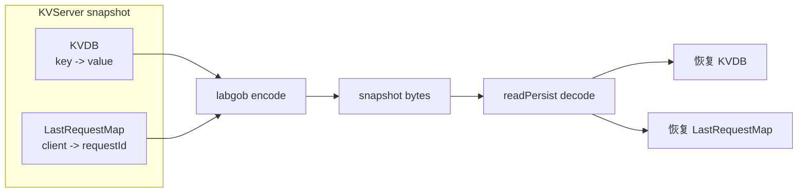
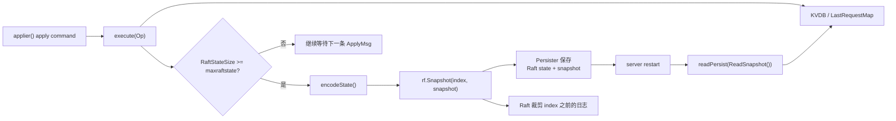
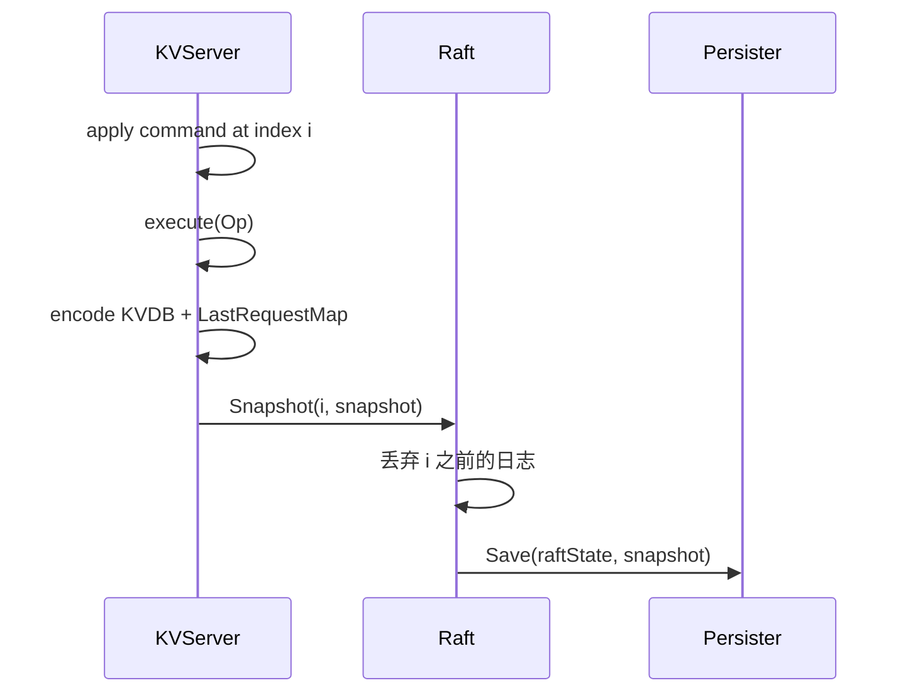
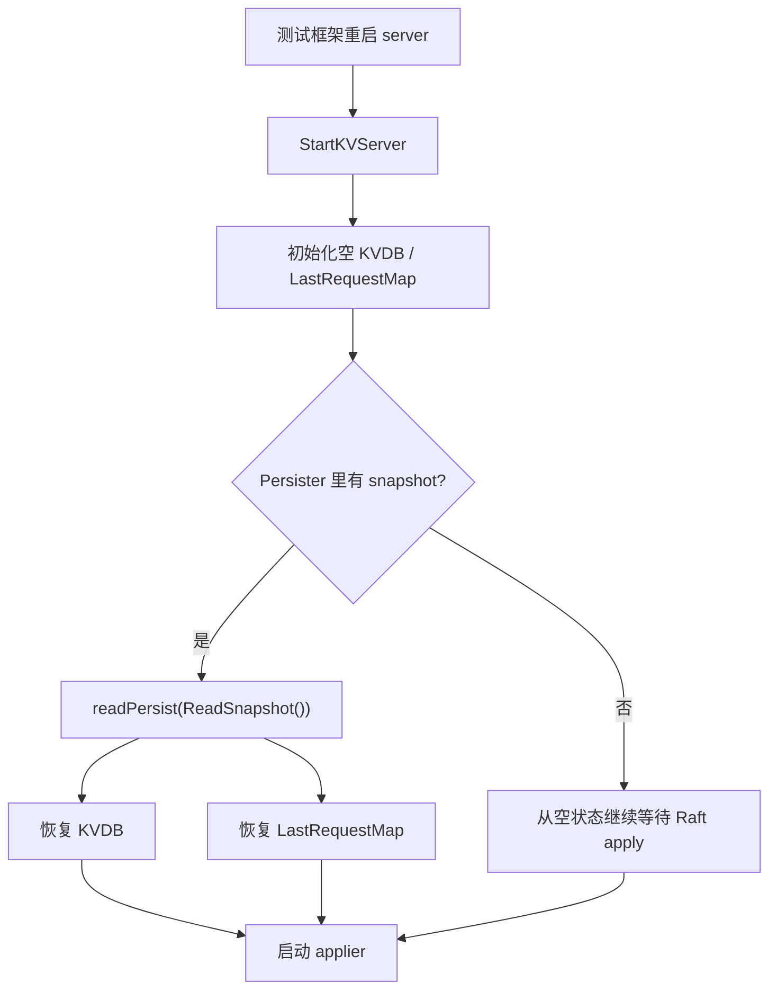
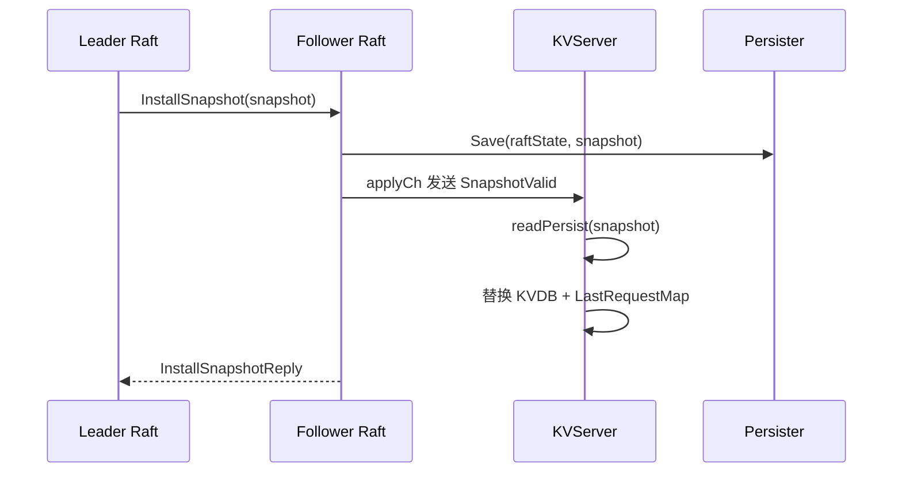
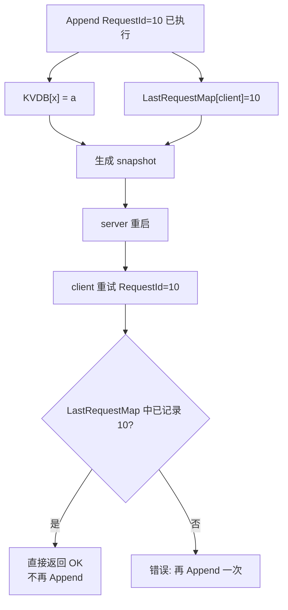

# Lab4B KVRaft Snapshot 与恢复

一句话主线：

```text
KVServer apply 命令后发现 Raft 日志太大 -> 编码 KVDB + LastRequestMap -> 调 Raft.Snapshot(index, snapshot) -> Raft 裁剪旧日志并持久化快照 -> 重启或落后副本从 snapshot 恢复
```

Lab4B 解决的是日志无限增长的问题。Lab4A 中每个 `Get/Put/Append` 都会进入 Raft 日志；如果系统长期运行，重启时就要重放很长的日志。Snapshot 把“已经 apply 到某个 index 的状态机结果”保存下来，让 Raft 可以丢掉这之前的日志。

## 先抓重点

- Snapshot 保存的是 KVServer 状态机结果，不是完整 Raft 日志。
- KVServer snapshot 至少要保存 `KVDB` 和 `LastRequestMap`。
- 只有已经 apply 的日志才能被做进 snapshot。
- Raft 负责裁剪旧日志和持久化 snapshot。
- 重启或落后副本追赶时，会从 snapshot 恢复状态。

## Snapshot 保存什么

KVServer 的 snapshot 保存的是上层状态机，不是 Raft 自己的 term、vote、log。

| 状态 | 是否保存 | 原因 |
| --- | --- | --- |
| `KVDB` | 是 | 恢复后要知道每个 key 当前的 value。 |
| `LastRequestMap` | 是 | 恢复后仍要识别客户端重复写请求，保证 at-most-once。 |
| `waitChMap` | 否 | 这是当前 RPC 等待表，重启后旧 RPC 已经不存在。 |
| `applyCh` | 否 | 通道是运行时对象，不能持久化。 |
| `LeaderId` / Clerk 状态 | 否 | 客户端本地会继续重试；服务端只保存去重表。 |

当前实现的编码入口：

```text
encodeState()
  -> Encode(KVDB)
  -> Encode(LastRequestMap)
```

恢复入口：

```text
readPersist(snapshot)
  -> Decode(KVDB)
  -> Decode(LastRequestMap)
```



## 整体架构



## 何时触发 snapshot

Lab4B 的阈值来自测试框架传给 `StartKVServer` 的 `maxraftstate`。

| 条件 | 行为 |
| --- | --- |
| `maxraftstate == -1` | 不需要 snapshot，Lab4A 使用这种模式。 |
| `persister.RaftStateSize() < maxraftstate` | Raft 状态还不大，不做 snapshot。 |
| `persister.RaftStateSize() >= maxraftstate` | KVServer 编码状态机并调用 `rf.Snapshot()`。 |

当前实现是在每条 command apply 完成后检查：

```text
applier()
  -> execute(op)
  -> if maxraftstate != -1 && RaftStateSize() >= maxraftstate
  -> rf.Snapshot(applyMsg.CommandIndex, encodeState())
```

Snapshot 的 index 必须是已经 apply 的日志 index。这样含义才清楚：

```text
这个 snapshot 已经包含了 <= index 的所有客户端操作结果。
Raft 可以丢掉 <= index 的旧日志。
```

## Snapshot 流程



注意：KVServer 只负责告诉 Raft “我已经把 index i 之前的状态机结果做成 snapshot 了”。真正的日志裁剪和持久化由 Raft 完成。

## 重启恢复

server 重启时，测试框架会保留对应 server 的 `Persister`，然后重新调用 `StartKVServer()`。

恢复链路：

```text
StartKVServer(...)
  -> 初始化 KVDB / LastRequestMap
  -> kv.readPersist(kv.persister.ReadSnapshot())
  -> go kv.applier()
```

如果 snapshot 不为空，`readPersist()` 会恢复：

```text
KVDB: 已经 apply 过的 key/value
LastRequestMap: 每个 client 已处理到的最大 RequestId
```



保存 `LastRequestMap` 很重要。否则 server 重启后虽然恢复了 KV 数据，却忘记某个 `Append` 已经执行过；客户端重试同一个请求时，就可能把 value 再追加一遍。

## 落后副本如何追 snapshot

除了重启恢复，snapshot 还用于落后副本追赶 leader。

当某个 follower 落后太多，leader 已经把它需要的旧日志裁掉了，Raft 会改发 `InstallSnapshot`。follower 的 Raft 收到后持久化 snapshot，并通过 `applyCh` 给 KVServer 发送：

```text
ApplyMsg{
  SnapshotValid: true,
  Snapshot:      ...
  SnapshotIndex: ...
  SnapshotTerm:  ...
}
```

KVServer 的 `applier()` 看到 `SnapshotValid` 后会：

```text
1. 用 SnapshotIndex 判断这个 snapshot 是否过期
2. 如果不是旧 snapshot，就 readPersist(Snapshot)
3. 用 snapshot 中的数据替换本地 KVDB 和 LastRequestMap
```

这一步和普通 command apply 是互斥的：command 修改状态机，snapshot 则直接把状态机恢复到某个已经压缩好的结果。



## Command 和 Snapshot 的区别

| ApplyMsg 类型 | 来源 | KVServer 做什么 |
| --- | --- | --- |
| `CommandValid` | Raft 提交了一条客户端 `Op` | 执行 `Get/Put/Append`，必要时通知等待中的 RPC handler。 |
| `SnapshotValid` | Raft 安装了一份快照 | 解码快照，恢复 `KVDB` 和 `LastRequestMap`。 |

普通 command 是增量操作：

```text
Put x=1
Append x=2
Get x
```

Snapshot 是某个 index 之前的整体结果：

```text
截至 index=50:
  KVDB[x] = "12"
  LastRequestMap[c1] = 17
```

所以安装 snapshot 时不需要重放里面的每条历史操作；它已经是历史操作执行后的状态。

## 与去重的关系

Snapshot 必须包含 `LastRequestMap`。这是 Lab4B 最容易漏掉的一点。

例子：

```text
client 7 发 Append("x", "a"), RequestId=10
leader commit 并执行，x 变成 "a"
leader 回复丢失，client 7 重试 RequestId=10
期间 server 做 snapshot 并重启
```

如果 snapshot 只保存 `KVDB`：

```text
KVDB["x"] = "a"
LastRequestMap 丢失
```

重启后服务端会以为 RequestId=10 没执行过，再 append 一次，结果错误变成：

```text
KVDB["x"] = "aa"
```

保存 `LastRequestMap` 后，重启的 server 仍能判断这个请求已经处理过，直接返回成功，不再修改 `KVDB`。



## 与 Raft 日志的关系

Snapshot 不是替代 Raft，而是帮 Raft 丢掉已经不再需要的前缀日志。

```text
snapshot index = 100

表示：
  KVServer 已经把日志 1..100 的结果编码进 snapshot。

之后：
  Raft 只需要保留 100 之后的日志。
  新启动的 KVServer 先读 snapshot，再继续 apply 100 之后的新日志。
```

这也解释了为什么 snapshot 必须和 Raft state 原子保存。如果只保存了 Raft 裁剪后的日志，却没保存对应 snapshot，重启时就会丢失状态机历史。

## 常见问题

### 为什么 snapshot 里不保存 Raft log？

Raft log 属于 Raft 层，已经由 `raft.Persister` 里的 Raft state 保存。KVServer snapshot 只保存上层状态机，也就是 `KVDB` 和 `LastRequestMap`。

### 为什么 `Get` 也会推动 snapshot？

当前 Lab4A/Lab4B 中 `Get` 也进入 Raft 日志。既然它占用 Raft 日志空间，就可能让 `RaftStateSize()` 增大。因此 apply `Get` 后也可能触发 snapshot。

### snapshot 会不会影响正在等待的 RPC？

Snapshot 是在 command apply 后触发的。当前 RPC 的等待通知仍然基于 command 的 log index。snapshot 保存的是已经 apply 的状态机结果，不会替代正在等待的 `waitChMap[index]`。

### 为什么收到旧 snapshot 要忽略？

网络可能乱序，或者 Raft 可能重复递交旧 snapshot。KVServer 已经 apply 到更靠后的 index 时，旧 snapshot 不能覆盖当前状态，否则会把状态机倒退。

## 测试关注点

| 测试方向 | 想验证什么 |
| --- | --- |
| snapshot size | 快照不能把无关的大对象也编码进去。 |
| restart + snapshot | server 重启后能从 snapshot 恢复 KV 数据和去重表。 |
| unreliable + snapshot | RPC 丢失、重复和乱序时仍保持 at-most-once。 |
| partition + snapshot | 落后副本能通过 InstallSnapshot 追上 leader。 |
| linearizable | snapshot 不改变客户端可观察到的线性一致语义。 |

## 代码入口

| 目标 | 文件/函数 |
| --- | --- |
| snapshot 编码 | `src/kvraft/server.go`: `encodeState` |
| snapshot 解码 | `src/kvraft/server.go`: `readPersist` |
| apply 后触发 snapshot | `src/kvraft/server.go`: `applier` |
| 服务启动时恢复 snapshot | `src/kvraft/server.go`: `StartKVServer` |
| Raft 裁剪日志 | `src/raft/raft.go`: `Snapshot` |
| Raft 安装 snapshot | `src/raft/raft.go`: `InstallSnapshot` |
| 持久化载体 | `src/raft/persister.go`: `Persister` |
