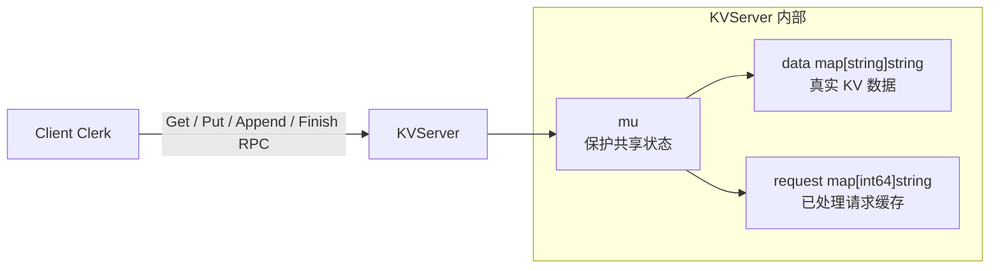
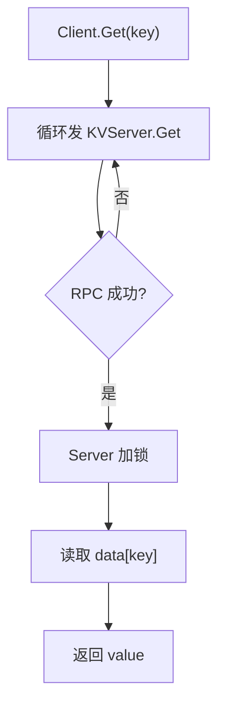
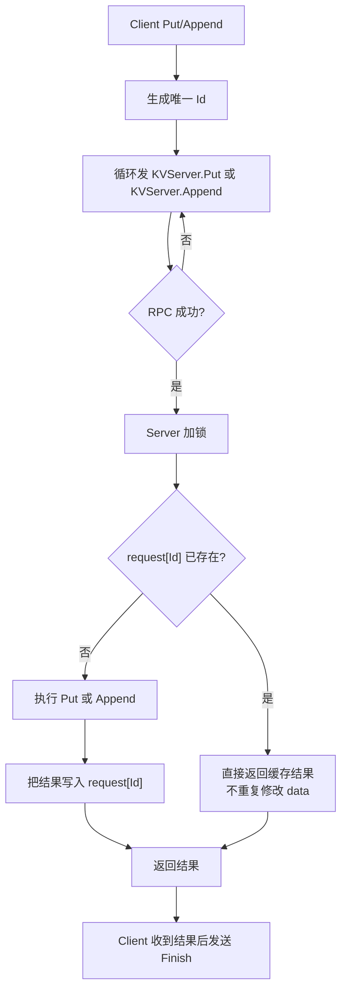
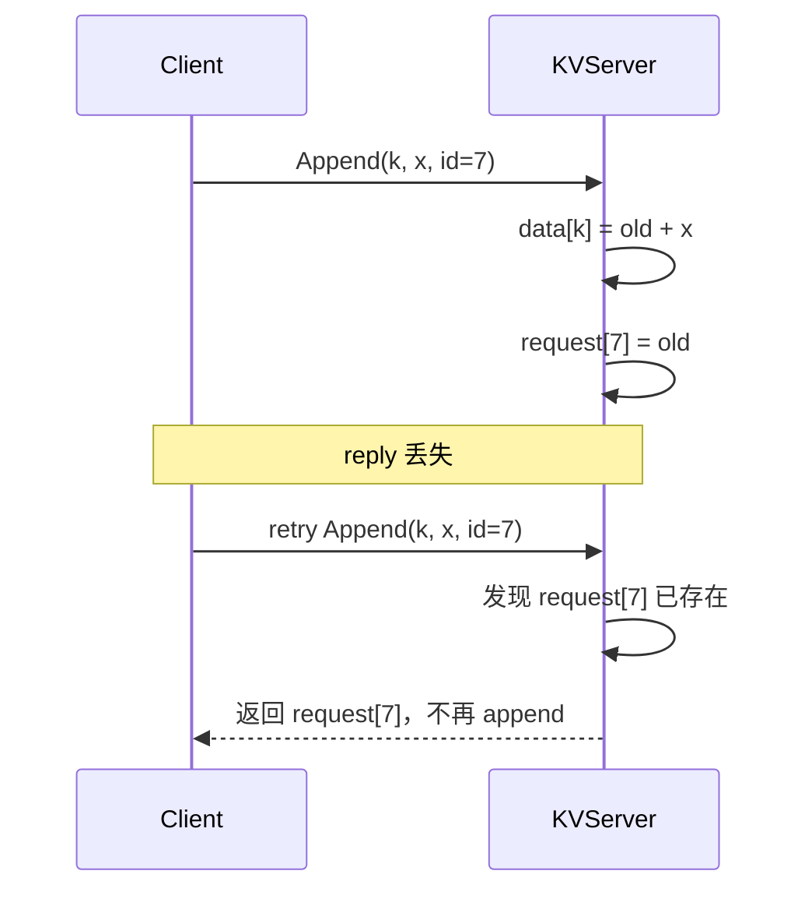

# Lab2 KVServer 核心操作

Lab2 是单机 Key/Value Server，没有 Raft，也没有分片。它的重点是：

```text
Client 通过 RPC 访问一个 KVServer；
RPC 可能失败，Client 会重试；
Server 用请求 ID 过滤重复 Put/Append，避免同一个写操作执行多次。
```

## 整体架构



## 核心数据

| 数据 | 位置 | 含义 |
| --- | --- | --- |
| `data map[string]string` | Server | 保存真实 key/value。 |
| `request map[int64]string` | Server | 保存已执行过的 Put/Append 请求结果，用来处理 RPC 重试。 |
| `Id int64` | Put/Append 请求参数 | 每个写请求的唯一 ID。 |
| `mu sync.Mutex` | Server | 保护 `data` 和 `request`，保证并发 RPC 不把 map 改乱。 |

## 操作表

| 操作 | 谁触发 | 是否修改 `data` | 是否使用请求 ID | 返回值 |
| --- | --- | --- | --- | --- |
| `Get` | Client | 否 | 否 | 当前 key 的 value；不存在返回空字符串。 |
| `Put` | Client | 是 | 是 | 当前实现返回写入的 value，Clerk 的 `Put` 会忽略返回值。 |
| `Append` | Client | 是 | 是 | 返回 append 前的旧 value。 |
| `Finish` | Client | 否 | 是 | 删除该请求 ID 的缓存，降低内存占用。 |

## Get 流程



`Get` 不需要去重，因为它不修改状态。RPC 失败时重试即可。

## Put / Append 去重流程



### Put

```text
如果 Id 没执行过:
  data[key] = value
  request[Id] = value

如果 Id 执行过:
  直接返回 request[Id]
```

### Append

```text
如果 Id 没执行过:
  oldValue = data[key]
  data[key] = oldValue + value
  request[Id] = oldValue

如果 Id 执行过:
  直接返回 request[Id]
```

`Append` 返回旧值是为了让测试检查线性化顺序：返回值里不应该包含本次 append 的新内容。

## 为什么需要 request 缓存

RPC 可能出现这种情况：

```text
Client 发 Append(k, "x", id=7)
  -> Server 已经执行: data[k] += "x"
  -> 回复在网络中丢了
  -> Client 以为失败，又用同一个 id=7 重试
```

如果没有 `request[id]`，Server 会再次执行 append：

```text
data[k] += "x"
```

结果同一个请求被执行两次。

有了 `request[id]`：



## Finish 的作用

`request` 不能无限增长。Client 成功收到 Put/Append 的结果后，会继续发送：

```text
KVServer.Finish(args)
```

Server 执行：

```go
delete(kv.request, args.Id)
```

所以 `Finish` 的作用是：

```text
客户端确认自己已经拿到结果；
Server 可以删除这个请求 ID 的缓存。
```

注意：`Finish` 只清理去重缓存，不修改真实 KV 数据。

## Client 重试行为

| 操作 | 重试方式 |
| --- | --- |
| `Get` | RPC 失败就一直重试同一个 `Get`。 |
| `Put` | 生成一个请求 ID，RPC 失败就用同一个 ID 重试。 |
| `Append` | 生成一个请求 ID，RPC 失败就用同一个 ID 重试。 |
| `Finish` | Put/Append 成功后发送；如果 Finish RPC 失败，也继续重试。 |

## 代码入口

| 目标 | 文件/函数 |
| --- | --- |
| RPC 参数 | `src/kvsrv/common.go` |
| Client 重试逻辑 | `src/kvsrv/client.go`: `Get`、`PutAppend`、`Put`、`Append` |
| Server 状态 | `src/kvsrv/server.go`: `KVServer` |
| 普通读 | `src/kvsrv/server.go`: `Get` |
| 写入和去重 | `src/kvsrv/server.go`: `Put`、`Append` |
| 请求缓存清理 | `src/kvsrv/server.go`: `Finish` |
