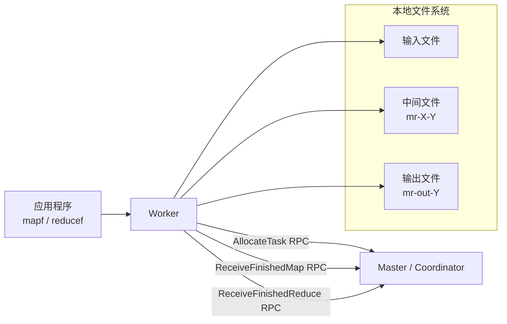
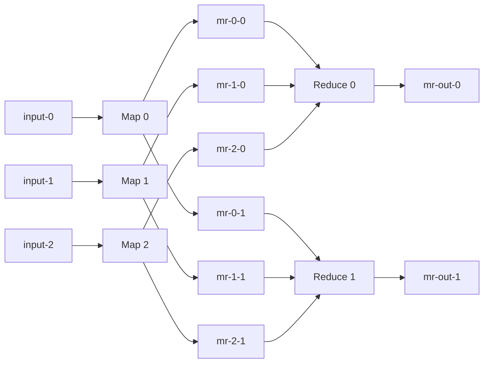
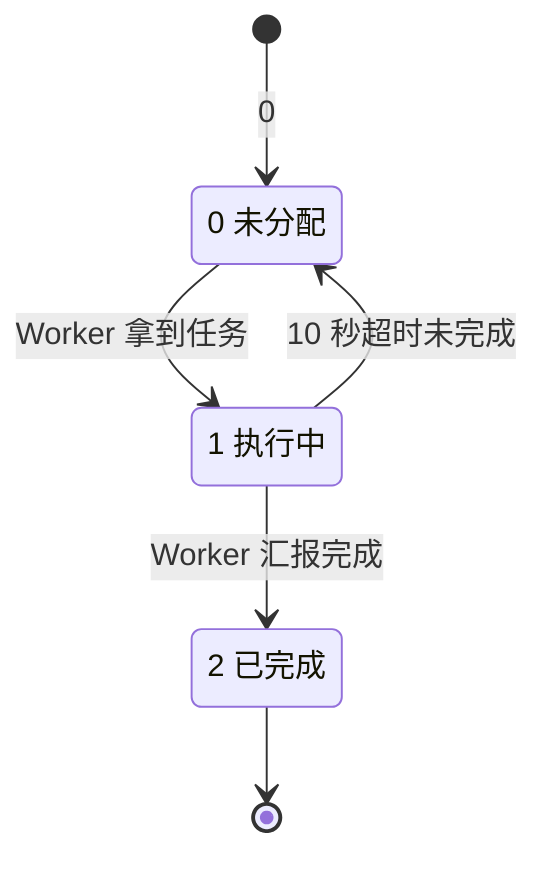
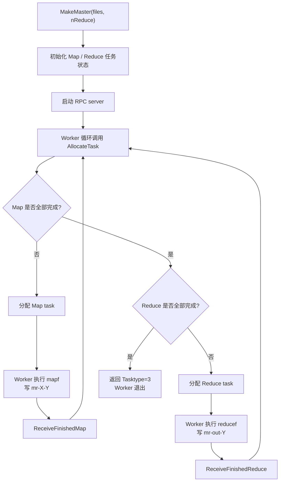
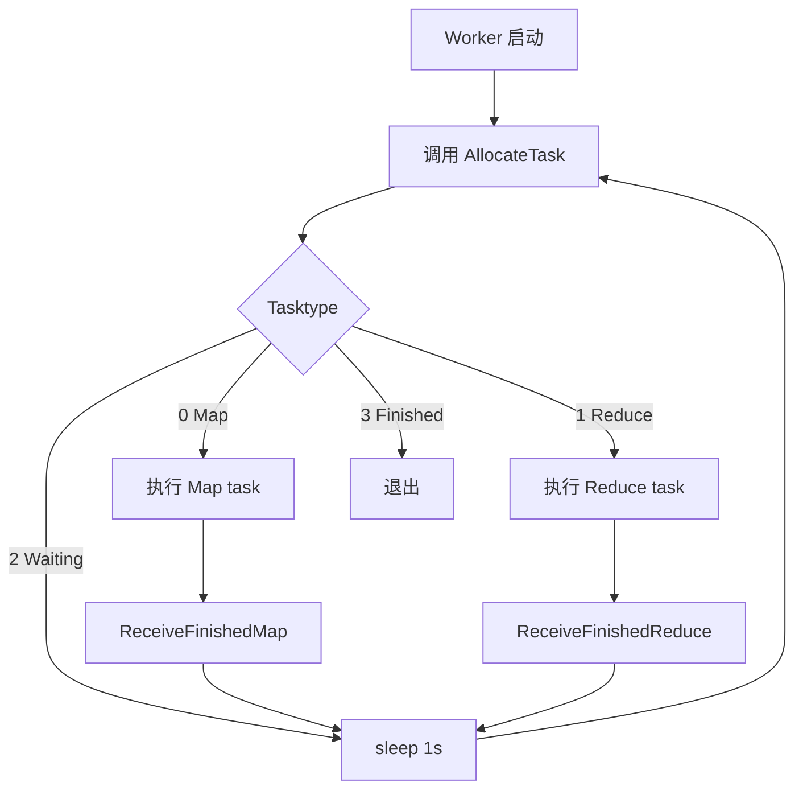
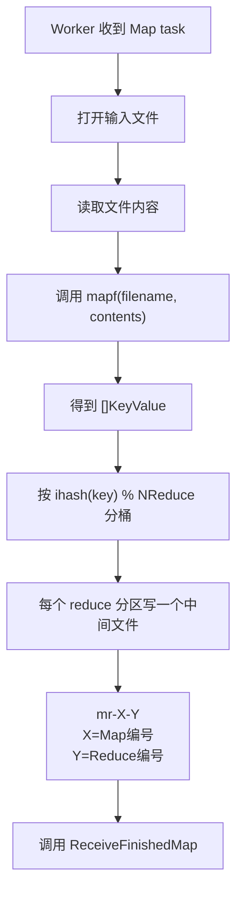
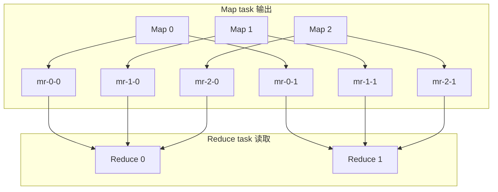
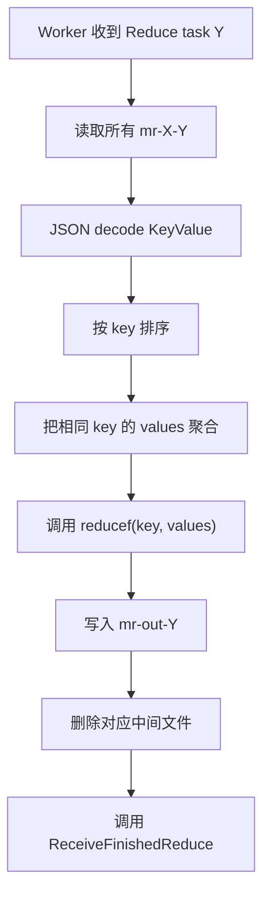
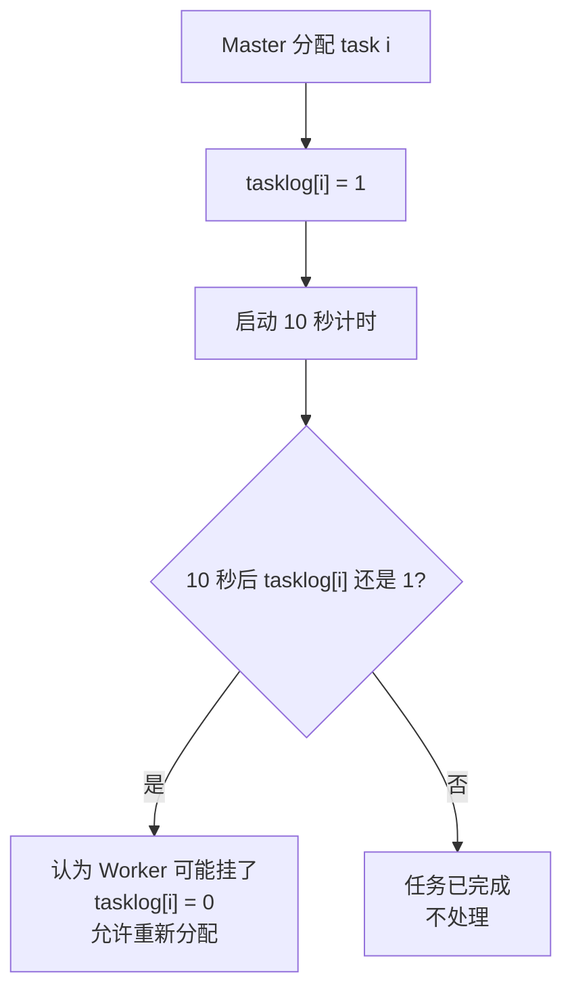
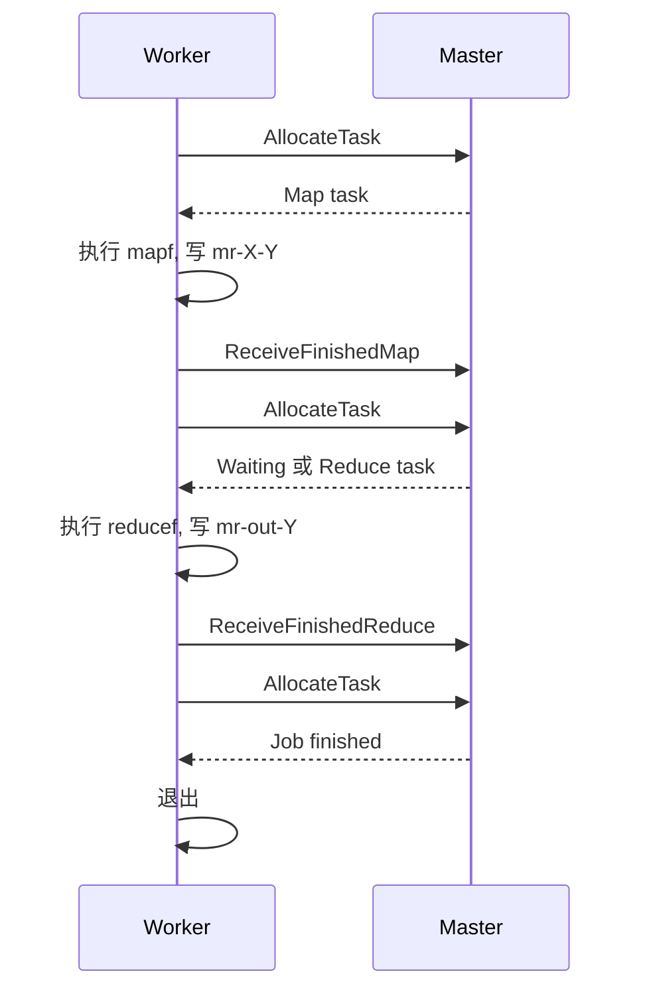

# Lab1 MapReduce 核心操作

Lab1 实现的是一个简化版 MapReduce 框架。应用只需要提供：

```text
mapf(filename, contents) -> []KeyValue
reducef(key, values) -> output
```

框架负责：

```text
分配 Map 任务 -> 生成中间文件 -> 分配 Reduce 任务 -> 生成最终输出
```

代码里使用 `Master` 命名，含义就是课程新版里常说的 `Coordinator`。

## 先抓重点

- Master 只负责分配任务、记录状态、处理超时，不亲自执行 Map/Reduce。
- Worker 主动找 Master 要任务，做完后再通知 Master。
- Map 任务输出 `mr-X-Y`，其中 `X` 是 Map 编号，`Y` 是 Reduce 编号。
- Reduce 任务读取所有 `mr-*-Y`，最后写出 `mr-out-Y`。
- 某个 Worker 卡住时，Master 会把执行中的任务重新变回可分配状态。

## 整体架构



## 数据流总览



这个图里的 `mr-X-Y` 表示：

```text
X = Map task 编号
Y = Reduce task 编号
```

## 核心数据

| 数据 | 位置 | 含义 |
| --- | --- | --- |
| `files []string` | Master | 输入文件列表；每个输入文件对应一个 Map task。 |
| `nMap` | Master | Map task 数量，等于输入文件数量。 |
| `nReduce` | Master | Reduce task 数量。 |
| `maptasklog []int` | Master | Map task 状态：`0` 未分配，`1` 执行中，`2` 已完成。 |
| `reducetasklog []int` | Master | Reduce task 状态：`0` 未分配，`1` 执行中，`2` 已完成。 |
| `mapfinished` | Master | 已完成 Map task 数量。 |
| `reducefinished` | Master | 已完成 Reduce task 数量。 |
| `mu` | Master | 保护任务状态，避免多个 Worker 并发抢同一个任务。 |

## 任务状态机

Map task 和 Reduce task 都用同一套状态数字：



## 任务类型

| `Tasktype` | 含义 | Worker 行为 |
| --- | --- | --- |
| `0` | Map task | 读取输入文件，调用 `mapf`，写 `mr-X-Y`。 |
| `1` | Reduce task | 读取所有对应 `mr-X-Y`，调用 `reducef`，写 `mr-out-Y`。 |
| `2` | Waiting | 暂时没有可分配任务，Worker 等一会再问。 |
| `3` | Job finished | 全部任务结束，Worker 退出。 |

## 主流程



重点：

```text
Reduce 阶段必须等所有 Map task 完成后才开始。
```

## Worker 拉任务循环



## Map Task 流程



中间文件命名：

```text
mr-X-Y

X = Map task 编号
Y = Reduce task 编号
```

同一个 key 一定会进入同一个 Reduce 分区：

```go
ihash(key) % NReduce
```

## 中间文件矩阵

假设有 `nMap = 3`、`nReduce = 2`：



所以：

```text
每个 Map task 会输出 nReduce 个中间文件。
每个 Reduce task 会读取所有 Map task 对应自己的那一列文件。
```

## Reduce Task 流程



Reduce task `Y` 会读取：

```text
mr-0-Y
mr-1-Y
...
mr-(nMap-1)-Y
```

最终输出文件：

```text
mr-out-Y
```

## Reduce 内部处理顺序


## 超时重分配

Master 分配任务后，会把任务状态标成执行中：

```text
tasklog[i] = 1
```

然后启动一个 10 秒检查：



这个机制处理的是：

```text
Worker 拿到任务后崩溃 / 卡住 / 没汇报完成
```

注意：任务可能被重新执行，所以 Worker 写文件时使用临时文件再 `Rename` 成正式文件，减少半成品文件被其他任务看到的风险。

## RPC 表

| RPC | 谁调用 | 作用 |
| --- | --- | --- |
| `AllocateTask` | Worker -> Master | 请求一个新任务。 |
| `ReceiveFinishedMap` | Worker -> Master | 汇报 Map task 完成。 |
| `ReceiveFinishedReduce` | Worker -> Master | 汇报 Reduce task 完成。 |
| `Done` | 测试框架 / main | 判断整个 job 是否结束。 |

## Worker / Master RPC 时序



## 代码入口

| 目标 | 文件/函数 |
| --- | --- |
| RPC 参数 | `src/mr/rpc.go` |
| Master 状态 | `src/mr/coordinator.go`: `Master` |
| 任务分配 | `src/mr/coordinator.go`: `AllocateTask` |
| 完成汇报 | `src/mr/coordinator.go`: `ReceiveFinishedMap`、`ReceiveFinishedReduce` |
| Job 完成判断 | `src/mr/coordinator.go`: `Done` |
| Worker 主循环 | `src/mr/worker.go`: `Worker` |
| Map 输出 | `src/mr/worker.go`: Map task 分支 |
| Reduce 输出 | `src/mr/worker.go`: Reduce task 分支 |
