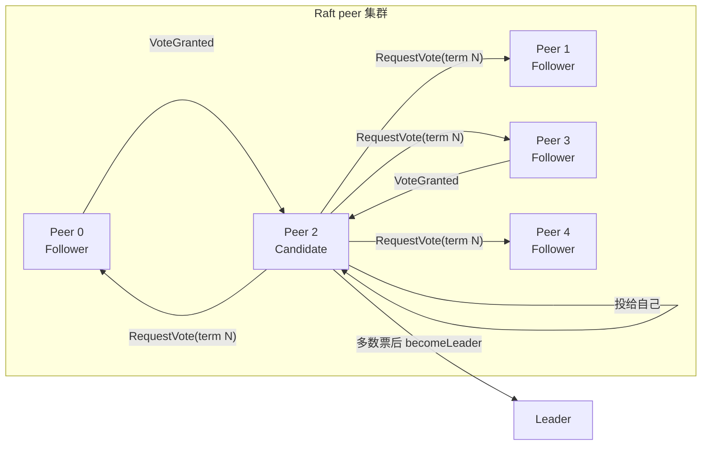
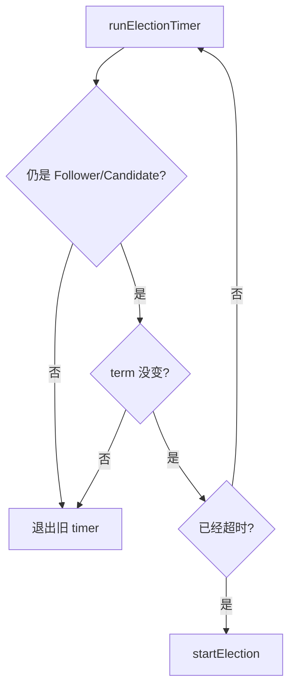
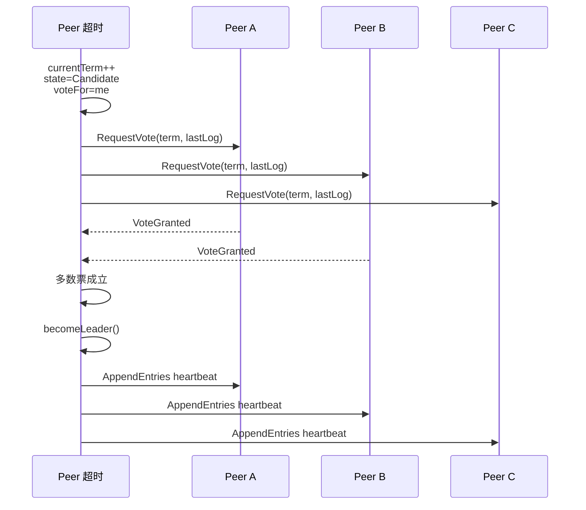
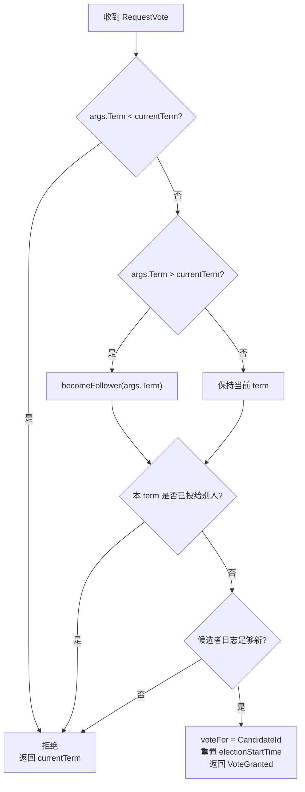
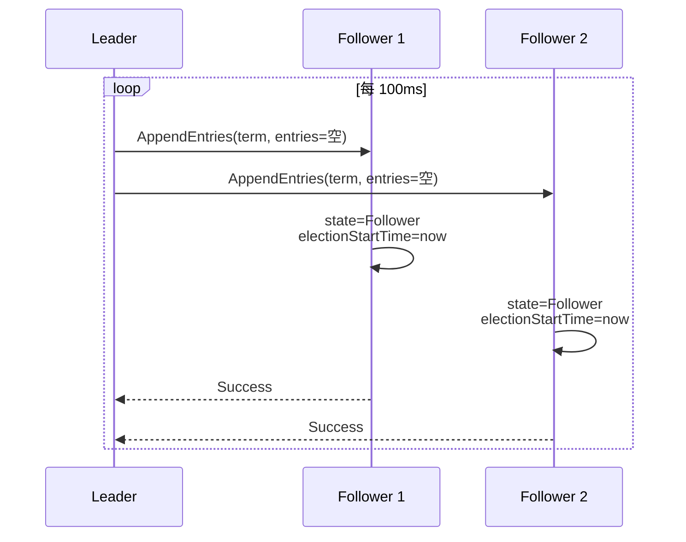
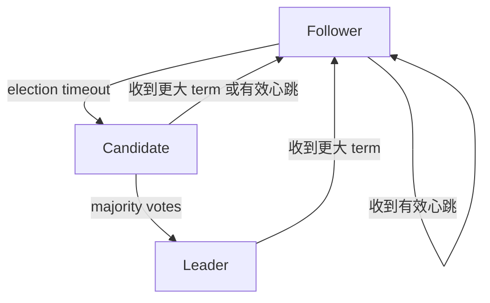

# Lab3A Raft 选举与心跳

一句话主线：

```text
Follower 超时 -> Candidate 发 RequestVote -> 拿到多数票 -> Leader 周期性发 AppendEntries 心跳
```

Lab3A 先不处理客户端命令，重点是让一组 Raft peer 能在 leader 失联后重新选出一个 leader。上层服务只需要知道：只有 leader 才能接收 `Start(command)`。

## 三种角色

| 角色 | 行为 |
| --- | --- |
| `Follower` | 被动接收 `RequestVote` 和 `AppendEntries`；超时后转为 `Candidate`。 |
| `Candidate` | 增加 term，投票给自己，向其他 peer 拉票。 |
| `Leader` | 周期性发送 `AppendEntries`；没有日志时就是心跳。 |

当前代码还用 `Dead` 表示测试框架 `Kill()` 后的本地状态，方便后台 goroutine 退出。



## 核心状态

| 字段 | 是否持久化 | 作用 |
| --- | --- | --- |
| `currentTerm` | 是 | 当前任期；任期越大，信息越新。 |
| `voteFor` | 是 | 当前 term 投给了谁；`-1` 表示还没投。 |
| `state` | 否 | 当前是 follower、candidate 还是 leader。 |
| `electionStartTime` | 否 | 最近一次收到有效心跳或投票的时间。 |

同一个 term 内，一个 peer 最多投一票。因为多数派之间一定有交集，这条规则保证同一个 term 不会出现两个合法 leader。

## 选举定时器

当前实现的选举超时是随机的：

```text
250ms 到 400ms
每 10ms 检查一次是否超时
```



代码里可能短暂存在多个 timer goroutine，所以它会检查启动 timer 时的 term 是否仍然等于当前 term。旧任期 timer 发现 term 变了就退出，避免旧 goroutine 误触发新选举。

## 发起选举

`startElection()` 做这些事：

```text
currentTerm += 1
state = Candidate
voteFor = me
electionStartTime = now
persist()
receivedVotes = 1
并发向其他 peer 发送 RequestVote
```

`RequestVoteArgs` 中除了 term 和 candidate id，还带上候选者最后一条日志：

| 字段 | 作用 |
| --- | --- |
| `LastLogIndex` | 候选者最后一条日志的 index。 |
| `LastLogTerm` | 候选者最后一条日志的 term。 |

虽然 Lab3A 的重点是选举，当前实现已经包含 Lab3B 所需的“日志新旧”投票规则。



## 投票规则

Follower 收到 `RequestVote` 后：

| 条件 | 行为 |
| --- | --- |
| `args.Term > currentTerm` | 自己落后，转成 follower 并更新 term。 |
| `args.Term < currentTerm` | 候选者落后，拒绝。 |
| 当前 term 已投给别人 | 拒绝。 |
| 候选者日志不够新 | 拒绝。 |
| 其他情况 | 投票，重置选举计时。 |

日志新旧比较：

```text
候选者 LastLogTerm 更大
或 LastLogTerm 相同且 LastLogIndex >= 自己的 lastLogIndex
```

这能防止日志落后的节点成为 leader。



## 成为 Leader

Candidate 只在自己仍是 candidate、term 也没变时处理投票回复。拿到多数票后调用 `becomeLeader()`。

成为 leader 后会初始化：

| 字段 | 初始值 | 含义 |
| --- | --- | --- |
| `nextIndex[i]` | `getNextIndex()` | 下次给 follower i 发送的日志 index。 |
| `matchIndex[i]` | `0` | 已知 follower i 复制成功的最大 index。 |

之后 leader 每 100ms 调用一次 `runHeartBeats()`。在没有新日志时，`AppendEntries.Entries` 为空，它就是心跳。



## 状态转换



## 代码入口

| 目标 | 文件/函数 |
| --- | --- |
| 角色和字段 | `src/raft/raft.go`: `Raft`、`RuleState` |
| 选举定时器 | `src/raft/raft.go`: `runElectionTimer`、`ticker` |
| 发起选举 | `src/raft/raft.go`: `startElection` |
| 投票 RPC | `src/raft/raft.go`: `RequestVote`、`sendRequestVote` |
| 状态转换 | `src/raft/raft.go`: `becomeFollower`、`becomeLeader` |
| 心跳 | `src/raft/raft.go`: `heartBeatsTimer`、`runHeartBeats` |
