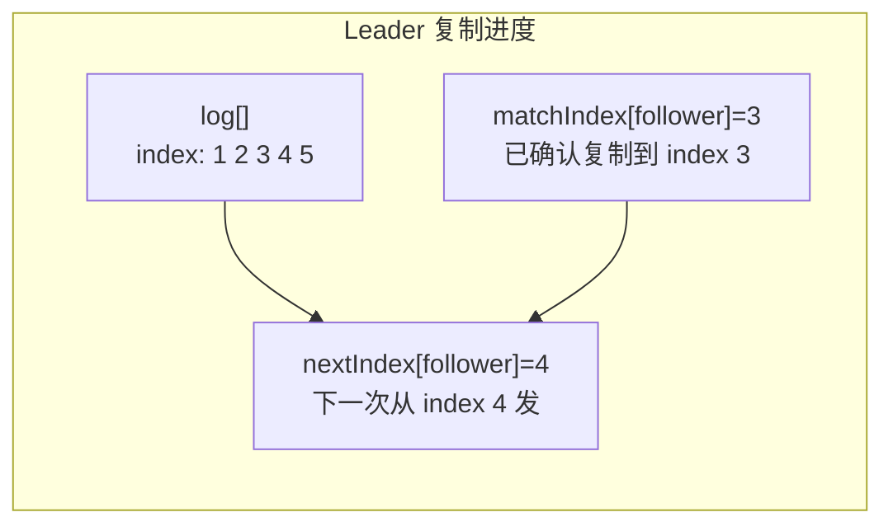
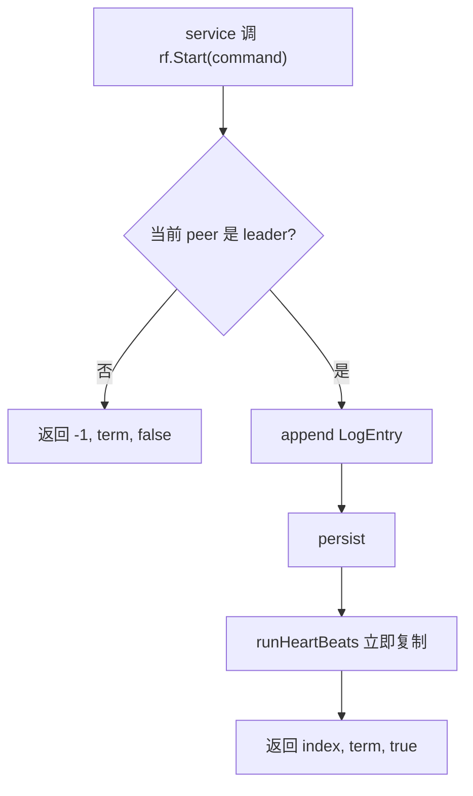
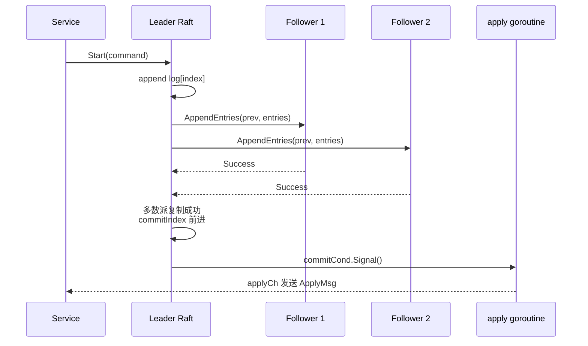
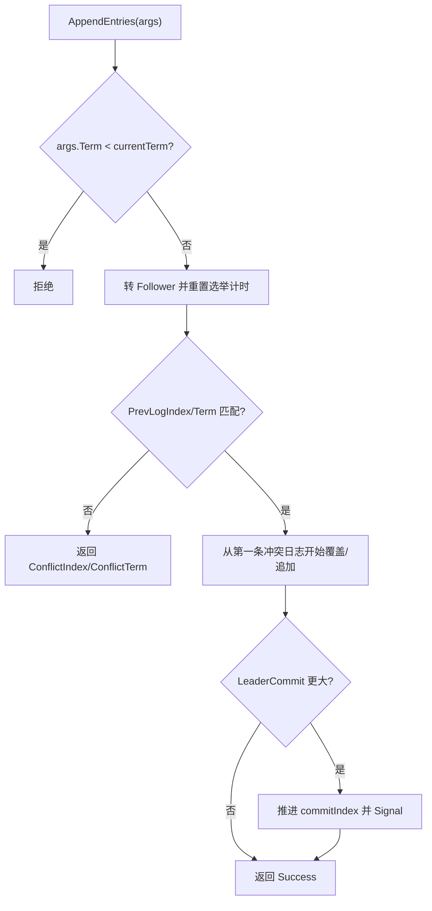
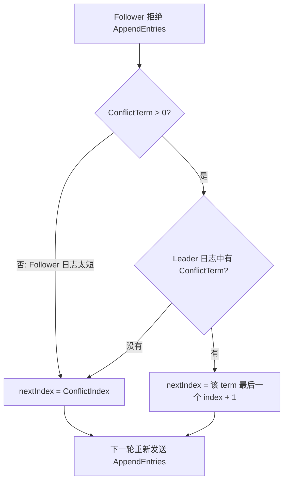
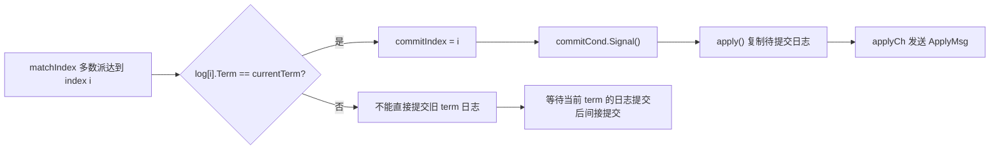

# Lab3B Raft 日志复制与提交

一句话主线：

```text
service 调 Start(command) -> leader 追加日志 -> AppendEntries 复制给 follower -> 多数派成功 -> commitIndex 前进 -> applyCh 交给上层
```

Lab3B 把 Lab3A 选出的 leader 变成日志复制入口。上层服务不需要自己广播命令，只需要把命令交给某个 Raft peer；如果它不是 leader，`Start()` 会返回 `isLeader=false`。

## 先抓重点

- `Start(command)` 成功只代表 leader 收下了命令，还不代表已经提交。
- Leader 用 `AppendEntries` 把日志复制给 follower。
- 日志复制到多数派后，leader 才能推进 `commitIndex`。
- `commitIndex` 前进后，apply goroutine 才会把命令送到 `applyCh`。
- `nextIndex/matchIndex` 只由 leader 用来追踪每个 follower 复制到哪里。

## 核心数据

| 字段 | 谁维护 | 含义 |
| --- | --- | --- |
| `log []LogEntry` | 所有 peer | 本地 Raft 日志。 |
| `commitIndex` | 所有 peer | 已知已经提交的最大日志 index。 |
| `lastApplied` | 所有 peer | 已经发送给上层状态机的最大日志 index。 |
| `nextIndex[]` | leader | 对每个 follower，下次要发送的日志 index。 |
| `matchIndex[]` | leader | leader 已知每个 follower 已复制到的最大 index。 |
| `commitCond` | 所有 peer | `commitIndex` 前进后唤醒 apply goroutine。 |

日志项：

```go
type LogEntry struct {
    Command interface{}
    Term    int
    Index   int
}
```

`Index` 是 Raft 日志的真实下标，不一定等于 Go slice 下标。Lab3D 有 snapshot 后，`log[0]` 会作为哨兵保存快照边界，所以代码用 `getFirstIndex()`、`getTerm(index)` 这类 helper 做换算。



## Start 路径



`Start()` 成功只表示 leader 已经接收这条命令，不表示已经 commit。上层服务必须等 `applyCh`。

## AppendEntries

Leader 给 follower 的复制 RPC：

| 字段 | 作用 |
| --- | --- |
| `Term` | leader 当前 term。 |
| `LeaderId` | leader id。 |
| `PrevLogIndex` | 新 entries 前一条日志的 index。 |
| `PrevLogTerm` | `PrevLogIndex` 对应的 term。 |
| `Entries` | 要追加或覆盖的日志；为空时是心跳。 |
| `LeaderCommit` | leader 当前 commitIndex。 |

Follower 只有在自己存在 `PrevLogIndex`，且该位置 term 等于 `PrevLogTerm` 时，才接受后续 entries。



## Follower 接收流程



Follower 可以覆盖未提交日志。旧 leader 留下的未提交日志不是权威结果，新 leader 的日志会覆盖这些后缀。

## 冲突回退

如果 follower 拒绝 `AppendEntries`，它会返回：

| 字段 | 含义 |
| --- | --- |
| `ConflictIndex` | leader 下次可以尝试的更早 index。 |
| `ConflictTerm` | follower 在冲突位置的 term；如果 follower 太短，可能是 `-1`。 |

leader 收到失败回复后，不是一条一条 `nextIndex--`，而是尽量跳过整段冲突 term：

```text
如果 leader 自己也有 ConflictTerm:
  nextIndex = leader 中该 term 最后一个 index + 1
否则:
  nextIndex = ConflictIndex
```

这能通过“leader backs up quickly over incorrect follower logs”这类测试。



## 提交与 apply

Follower 成功复制后，leader 更新：

```text
matchIndex[follower] = PrevLogIndex + len(Entries)
nextIndex[follower] = matchIndex[follower] + 1
```

然后 leader 尝试推进 `commitIndex`：

```text
从 commitIndex+1 往后看
只直接提交当前 term 的日志
如果复制到该 index 的 peer 数量达到多数派
  commitIndex = index
```

“只直接提交当前 term 的日志”是 Figure 8 的安全规则。旧 term 的日志会随着当前 term 日志提交而间接提交。

`commitIndex` 前进后，`apply()` goroutine 被唤醒：

```text
复制 lastApplied+1..commitIndex 的日志
lastApplied = commitIndex
逐条发送 ApplyMsg 到 applyCh
```

上层状态机只能在收到 `ApplyMsg` 后执行命令，不能在 `Start()` 时执行。



## 代码入口

| 目标 | 文件/函数 |
| --- | --- |
| 上层提交命令 | `src/raft/raft.go`: `Start` |
| leader 发送日志 | `src/raft/raft.go`: `runHeartBeats` |
| follower 接收日志 | `src/raft/raft.go`: `AppendEntries` |
| 处理复制回复 | `src/raft/raft.go`: `handleAppendEntriesRPCResponse` |
| commit 后 apply | `src/raft/raft.go`: `apply` |
| 日志下标 helper | `src/raft/raft.go`: `getFirstIndex`、`getLastIndex`、`getNextIndex`、`getTerm` |
