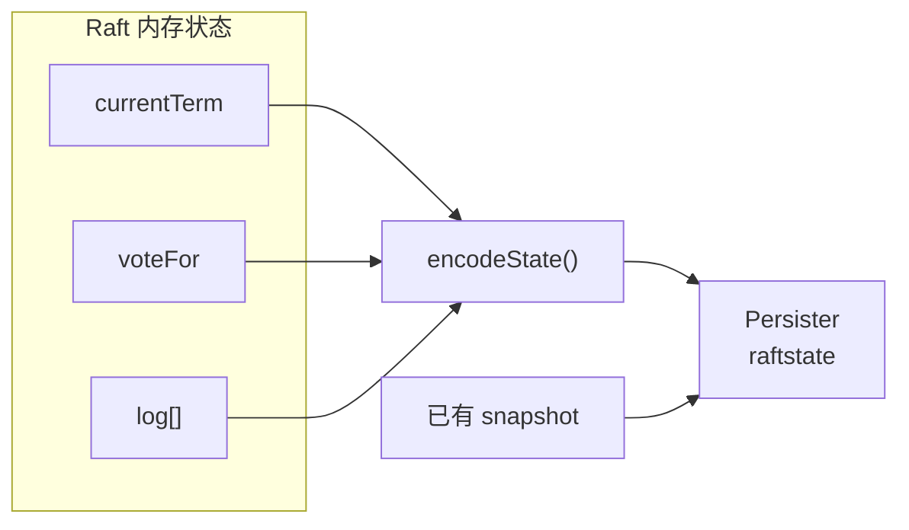
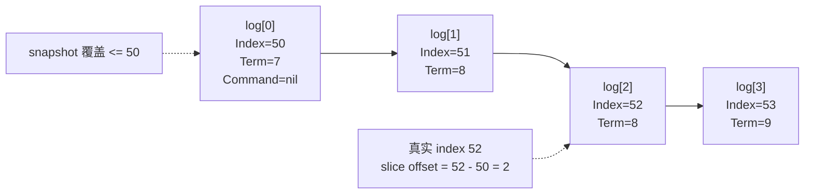
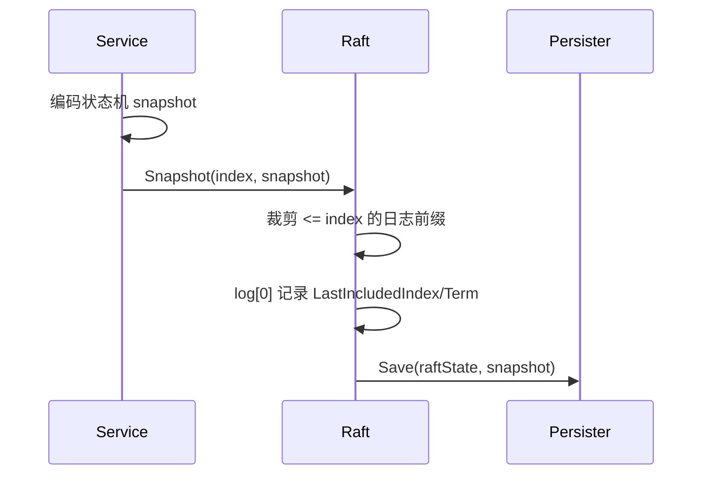
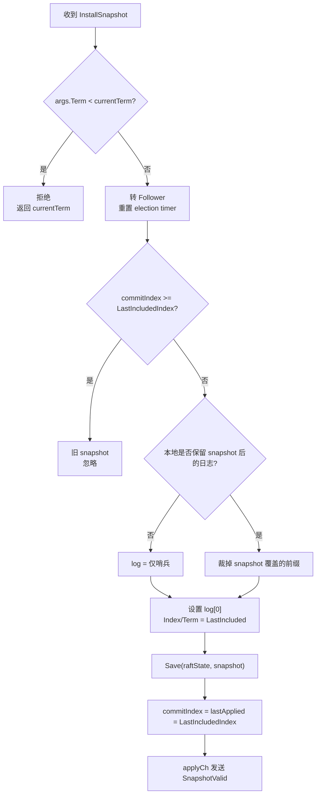
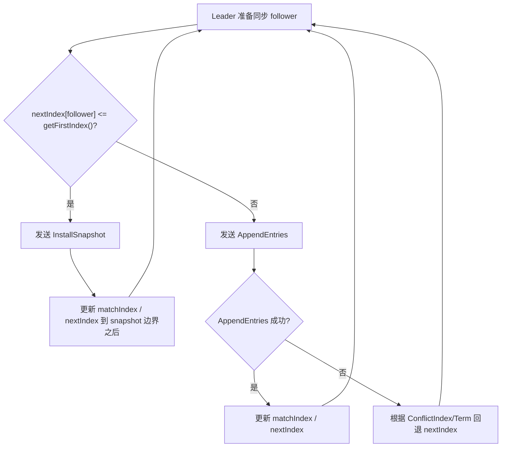

# Lab3C/3D Raft 持久化与快照

一句话主线：

```text
Raft 持久化 currentTerm / voteFor / log -> crash 后 readPersist 恢复 -> service 调 Snapshot 裁剪旧日志 -> 落后 follower 通过 InstallSnapshot 追上
```

Lab3C 解决 crash/restart 后不能忘记 Raft 关键状态的问题。Lab3D 解决日志无限增长的问题：上层服务已经把某段日志的结果做成 snapshot 后，Raft 可以丢掉那段日志。

## 持久化字段

当前实现持久化：

| 字段 | 原因 |
| --- | --- |
| `currentTerm` | 重启后不能回到旧 term，否则可能错误投票或当 leader。 |
| `voteFor` | 同一 term 已投出的票必须记住，避免重启后重复投票。 |
| `log` | 已接受的日志不能因为崩溃丢失。 |

不持久化：

| 字段 | 原因 |
| --- | --- |
| `commitIndex` | 可以通过 leader 的 `LeaderCommit` 或 snapshot 边界重新推进。 |
| `lastApplied` | 和上层状态机/snapshot 相关，重启时从 snapshot 边界继续。 |
| `nextIndex/matchIndex` | 只对 leader 有意义，成为 leader 时重新初始化。 |

编码入口：

```text
encodeState()
  -> currentTerm
  -> voteFor
  -> log
```

保存入口：

```text
persist()
  -> persister.Save(encodeState(), persister.ReadSnapshot())
```



## 什么时候 persist

| 场景 | 变化 |
| --- | --- |
| 发起选举 | `currentTerm++`，`voteFor = me`。 |
| 看到更大 term | 更新 `currentTerm`，转 follower。 |
| 给候选者投票 | 更新 `voteFor`。 |
| leader 接收命令 | `log` append 新 entry。 |
| follower 接收日志 | `log` 被覆盖或追加。 |
| 本地 snapshot | `log` 前缀被裁掉。 |
| 安装 leader snapshot | `log` 和 snapshot 一起更新。 |

这些地方漏持久化，重启后就可能忘记投票、丢日志，或者破坏已经达成的共识。

## 重启恢复

`Make()` 启动时：

```text
初始化 log
readPersist(persister.ReadRaftState())
commitIndex = getFirstIndex()
lastApplied = getFirstIndex()
初始化 nextIndex/matchIndex
启动 ticker 和 apply goroutine
```

如果没有 snapshot，`getFirstIndex()` 通常是 0。如果已经安装过 snapshot，`getFirstIndex()` 就是 snapshot 的 `LastIncludedIndex`。

## Snapshot 保存边界

上层服务调用：

```go
rf.Snapshot(index, snapshot)
```

含义是：

```text
service 已经把 <= index 的日志效果编码进 snapshot。
Raft 不再需要保留 <= index 的旧日志。
```

当前实现用 `log[0]` 当 snapshot 哨兵：

```text
log[0].Index = LastIncludedIndex
log[0].Term  = LastIncludedTerm
log[0].Command = nil
```

所以真实 index 和 slice 下标的关系是：

```text
slice offset = real index - getFirstIndex()
```



## 本地 Snapshot 流程



如果本地已经裁剪到更靠后的 index，`Snapshot()` 会忽略旧请求。

## InstallSnapshot

Leader 给 follower 同步时，如果：

```text
nextIndex[follower] <= getFirstIndex()
```

说明 follower 需要的日志已经被 leader 裁掉，普通 `AppendEntries` 补不了了，leader 会发送 `InstallSnapshot`。

`InstallSnapshotArgs` 包含：

| 字段 | 含义 |
| --- | --- |
| `LastIncludedIndex` | snapshot 覆盖到的最后一个日志 index。 |
| `LastIncludedTerm` | 该日志的 term。 |
| `Snapshot` | 上层服务编码出来的 snapshot 字节。 |

Follower 安装流程：

```text
如果 args.Term 更新，转 follower
如果 snapshot 已经过期，忽略
删除 snapshot 覆盖的日志前缀
设置 log[0] 为 LastIncludedIndex/Term
Save(raftState, snapshot)
commitIndex = lastApplied = LastIncludedIndex
向 applyCh 发送 SnapshotValid ApplyMsg
```



最后一步让上层服务真正安装 snapshot。Raft 只管理日志边界；KVDB、去重表等状态机内容由上层服务自己解码。

## Snapshot 与 AppendEntries

| 情况 | 使用什么 |
| --- | --- |
| follower 只是少几条日志 | `AppendEntries` 补 entries。 |
| follower 日志冲突但 leader 还保留旧日志 | `AppendEntries` + conflict 回退。 |
| follower 落后到 leader 已裁掉所需日志 | `InstallSnapshot`。 |

安装 snapshot 成功后，leader 更新该 follower：

```text
matchIndex[follower] = LastIncludedIndex
nextIndex[follower] = LastIncludedIndex + 1
```

之后再继续用 `AppendEntries` 复制 snapshot 后面的新日志。



## 代码入口

| 目标 | 文件/函数 |
| --- | --- |
| Raft state 编码 | `src/raft/raft.go`: `encodeState` |
| 持久化保存 | `src/raft/raft.go`: `persist` |
| 重启恢复 | `src/raft/raft.go`: `readPersist`、`Make` |
| 本地日志裁剪 | `src/raft/raft.go`: `Snapshot` |
| leader 发送 snapshot | `src/raft/raft.go`: `runHeartBeats` |
| follower 安装 snapshot | `src/raft/raft.go`: `InstallSnapshot` |
| snapshot 回复处理 | `src/raft/raft.go`: `handleInstallSnapshotRPCResponse` |
| 持久化载体 | `src/raft/persister.go`: `Persister` |
