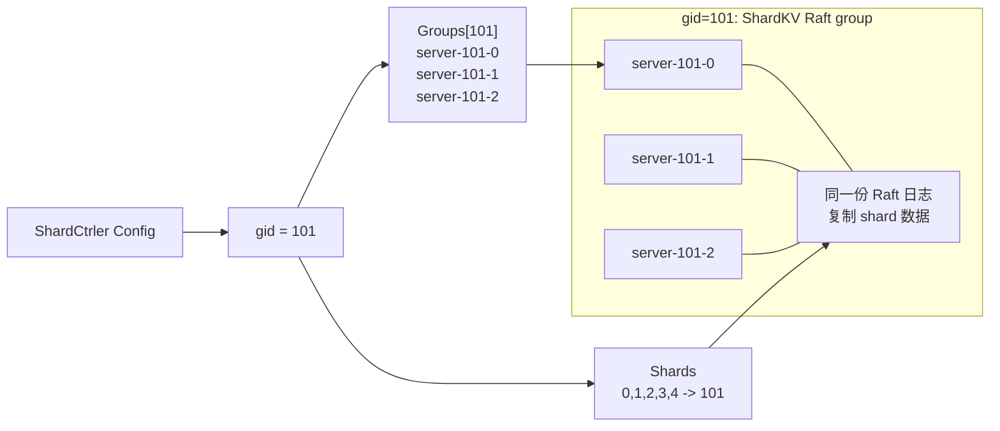
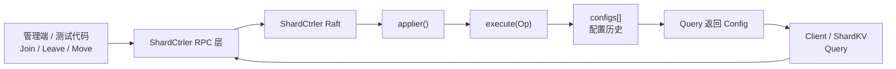
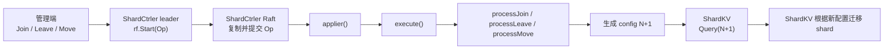
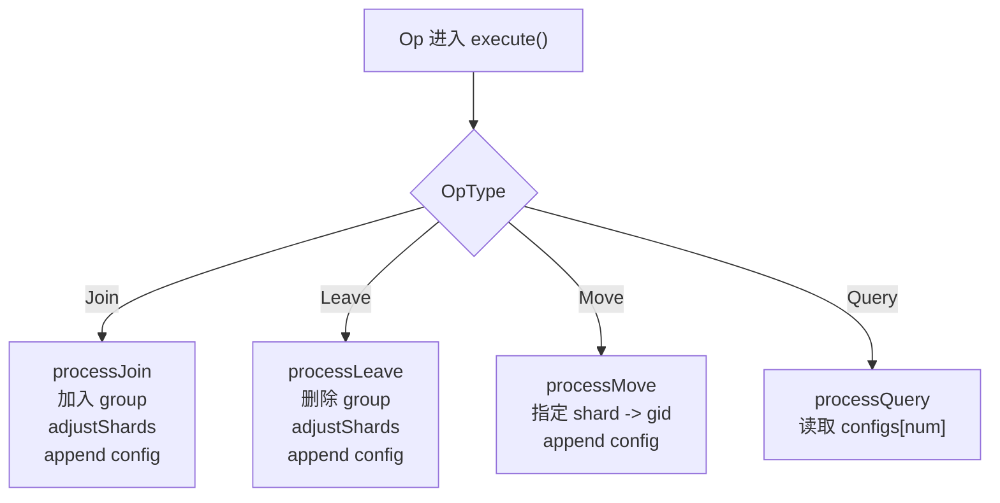
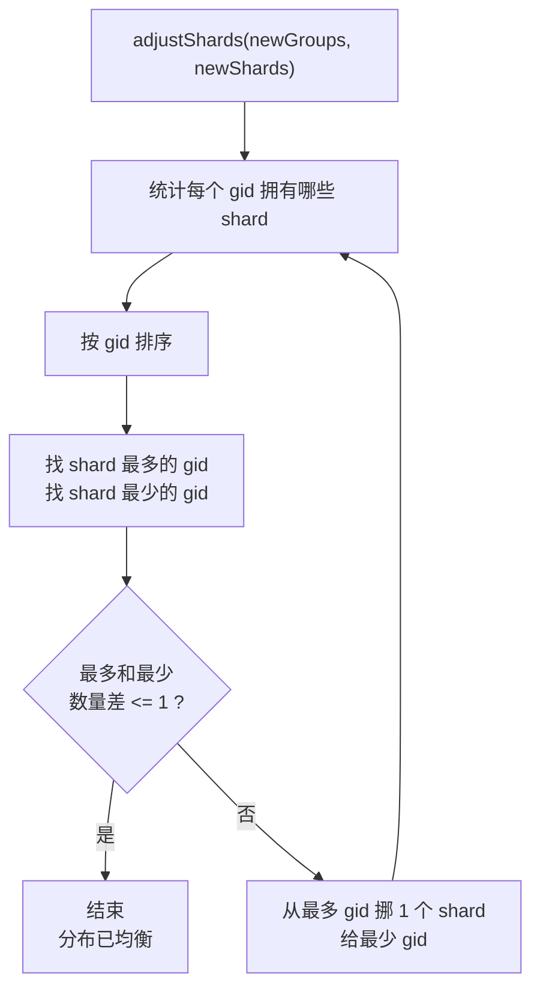

# Lab5A ShardCtrler 核心操作

ShardCtrler 只负责一件事：

```text
维护配置历史：每个 config 记录 10 个 shard 分别属于哪个 gid。
```

它不保存 KV 数据，也不迁移 shard 数据；真正搬数据的是 Lab5B 的 ShardKV。

## 固定分片模型

Lab5 里的 shard 数量是固定的：

```go
const NShards = 10
```

所以 `Join/Leave/Move` 不会创建或删除 shard，只会改变已有 shard 的归属：

```text
shard 数量固定: 0, 1, 2, ... 9
配置变化改变的是: shard -> gid
```

例子：

```text
Join gid=101 之前:
  shard 0-9 全部属于 gid=100

Join gid=101 之后:
  shard 0-4 属于 gid=101
  shard 5-9 属于 gid=100
```

真实系统里也有类似固定 slot 模型，例如 Redis Cluster 固定 16384 个 hash slot；也有 TiKV、CockroachDB、HBase 这类动态 split/merge 分片的系统。Lab5 采用固定分片，是为了把重点放在配置变更和 shard 迁移上。

## Group 是什么

`Join` 加入的不是单台 server，而是一个新的 ShardKV 复制组：

```text
gid -> servers[]
```

这些 `servers[]` 共同组成一个 ShardKV Raft 集群。ShardCtrler 只记录这个 group 的 server 列表，并把一部分 shard 分配给这个 `gid`；真正的数据复制由这个 group 内部的 Raft 完成。

例子：

```go
Join(map[int][]string{
    101: {"server-101-0", "server-101-1", "server-101-2"},
})
```

含义：

```text
新增 gid=101 这个 ShardKV Raft group
server-101-0 / server-101-1 / server-101-2 属于同一个 Raft 集群
ShardCtrler 会把一部分 shard 分配给 gid=101
```



## 整体架构



## 配置变更主线

ShardCtrler 对应的主线是：

```text
管理端发 Join/Leave/Move
  -> ShardCtrler leader 提交 Op 到 Raft
  -> 所有 ShardCtrler 副本 apply 同一个 Op
  -> processJoin/processLeave/processMove 生成 config N+1
  -> ShardKV 通过 Query(N+1) 拉到新配置
  -> ShardKV 根据新配置执行 shard 迁移
```



和 Lab5B 的关系可以这样对上：

| 阶段 | ShardCtrler 做什么 | ShardKV 做什么 |
| --- | --- | --- |
| 配置变化 | `Join/Leave/Move` 生成新 config | `monitorRequestConfig` 拉取新 config |
| owner 改变 | 只更新 `Config.Shards` 里的 `shard -> gid` | old owner 标 `BePulling`，new owner 标 `Pulling` |
| 数据迁移 | 不参与 | new owner 拉 shard，old owner 删除旧 shard |
| 收尾 | 保存完整配置历史，供后续 `Query` | 所有 shard 回到 `Serving` 后继续追下一版配置 |

## 核心数据

| 数据 | 含义 |
| --- | --- |
| `configs []Config` | 所有历史配置，`configs[i]` 就是 config i。 |
| `Config.Num` | 配置编号，从 0 开始递增。 |
| `Config.Shards [10]int` | `shard -> gid`，表示每个 shard 归哪个 group。 |
| `Config.Groups map[int][]string` | `gid -> servers[]`，表示每个 ShardKV Raft group 里有哪些 server。 |
| `LastRequestMap` | 记录每个 client 已处理到的最大请求号，避免重复执行。 |
| `waitChMap` | RPC handler 等待自己提交的 Raft 日志 apply。 |

初始配置：

```text
config 0:
  Groups = 空
  Shards 全部属于 gid 0
```

## 四个外部操作

| 操作 | 参数 | 是否生成新配置 | 核心作用 |
| --- | --- | --- | --- |
| `Join` | `map[gid][]servers` | 是 | 新 ShardKV Raft group 加入，加入后重新均衡 shard。 |
| `Leave` | `[]gid` | 是 | group 离开，把它的 shard 重新分给剩余 group。 |
| `Move` | `shard, gid` | 是 | 手动把某个 shard 指定给某个 gid。 |
| `Query` | `num` | 否 | 查询指定配置；`num == -1` 或过大时返回最新配置。 |

这些操作都是外部 Clerk 通过 RPC 触发的，ShardCtrler 收到后再放进自己的 Raft 日志里串行执行。通常测试代码或管理端会调用 `Join`、`Leave`、`Move` 来改变配置；ShardKV group 和普通客户端主要调用 `Query` 来观察配置。

按操作粒度看：

| 操作 | 粒度 | 是否改 group 集合 | 是否改 shard 分配 |
| --- | --- | --- | --- |
| `Join` | group 级别 | 是，加入一个或多个 gid | 是，加入后整体 rebalance |
| `Leave` | group 级别 | 是，移除一个或多个 gid | 是，把离开 group 的 shard 重新分给剩余 group |
| `Move` | shard 级别 | 否 | 是，只改一个 `Config.Shards[shard] = gid` |
| `Query` | 读配置 | 否 | 否 |

所以 `Join` / `Leave` 的核心是改变 `Config.Groups`，再根据新的 group 集合重新均衡 `Config.Shards`；`Move` 不改变有哪些 group，只是手动覆盖某一个 shard 的 owner，也不会做整体 rebalance。



## 请求执行链路

| 阶段 | 做什么 |
| --- | --- |
| RPC handler | 收到 `Join/Leave/Move/Query`，先检查是否重复请求。 |
| `rf.Start(op)` | leader 把操作提交给 ShardCtrler 自己的 Raft。 |
| `applier()` | Raft apply 后调用 `execute()`。 |
| `execute()` | 根据 `OpType` 分发到 `processJoin/processLeave/processMove/processQuery`。 |
| `notifyWaitCh()` | leader 把 apply 结果唤醒给正在等待的 RPC handler。 |

重点：

```text
ShardCtrler 的配置变化也必须走 Raft。
这样所有 ShardCtrler 副本都会生成同一串 configs。
```

## Join / Leave / Move / Query

| 函数 | 具体逻辑 |
| --- | --- |
| `processJoin` | 深拷贝上一份 `Groups` 和 `Shards`，加入新 gid，然后调用 `adjustShards` 均衡，最后 append 新配置。 |
| `processLeave` | 深拷贝上一份配置，把离开 group 的 shard 先标成 gid 0，删除这些 group，再调用 `adjustShards` 均衡，最后 append 新配置。 |
| `processMove` | 深拷贝上一份配置，只修改指定 shard 的 gid，直接 append 新配置，不做整体均衡。 |
| `processQuery` | 只读历史配置；`-1` 或超过最大编号返回最新配置，否则返回 `configs[num]`。 |

## Rebalance 规则

`adjustShards` 的目标：

```text
所有有效 group 之间 shard 数量尽量平均，最多相差 1。
```

核心步骤：

| 步骤 | 说明 |
| --- | --- |
| 1 | 统计每个 gid 当前有哪些 shard。 |
| 2 | 找 shard 最多的 gid 和 shard 最少的 gid。 |
| 3 | 每次从最多的 gid 挪一个 shard 给最少的 gid。 |
| 4 | 重复直到最大数量和最小数量差不超过 1。 |

特殊点：

| 点 | 原因 |
| --- | --- |
| gid 0 优先被挪走 | gid 0 表示无效 group，Join/Leave 后不能长期持有 shard。 |
| 遍历 gid 前先排序 | Go map 遍历顺序随机；排序能保证所有副本算出同样结果。 |
| `Groups` 需要深拷贝 | 历史配置不能被后续配置污染。 |



## Clerk 行为

| 操作 | 行为 |
| --- | --- |
| `Join/Leave/Move/Query` | 挨个尝试 ShardCtrler server。 |
| 遇到 follower | 收到 `WrongLeader` 后换下一个 server。 |
| 请求成功 | `RequestId++`，返回。 |
| RPC 失败 | sleep 后继续重试。 |

## 和 Lab5B 的关系

| ShardCtrler | ShardKV |
| --- | --- |
| 生成配置：哪个 shard 属于哪个 gid。 | 根据配置决定是否服务请求、是否迁移 shard。 |
| 保存所有历史 config。 | 用 `lastConfig/currentConfig` 判断 old owner 和 new owner。 |
| 不搬 KV 数据。 | 通过 `GetShards/InsertShard/DeleteShards` 搬数据并清理旧副本。 |

## 代码入口

| 目标 | 文件/函数 |
| --- | --- |
| RPC 参数和 `Config` | `src/shardctrler/common.go` |
| Clerk 重试逻辑 | `src/shardctrler/client.go` |
| RPC handler | `src/shardctrler/server.go`: `Join`、`Leave`、`Move`、`Query` |
| Raft apply 链路 | `src/shardctrler/server.go`: `applier`、`execute` |
| 配置生成 | `src/shardctrler/server.go`: `processJoin`、`processLeave`、`processMove`、`processQuery` |
| shard 均衡 | `src/shardctrler/server.go`: `adjustShards`、`findMaxAndMinGid` |
