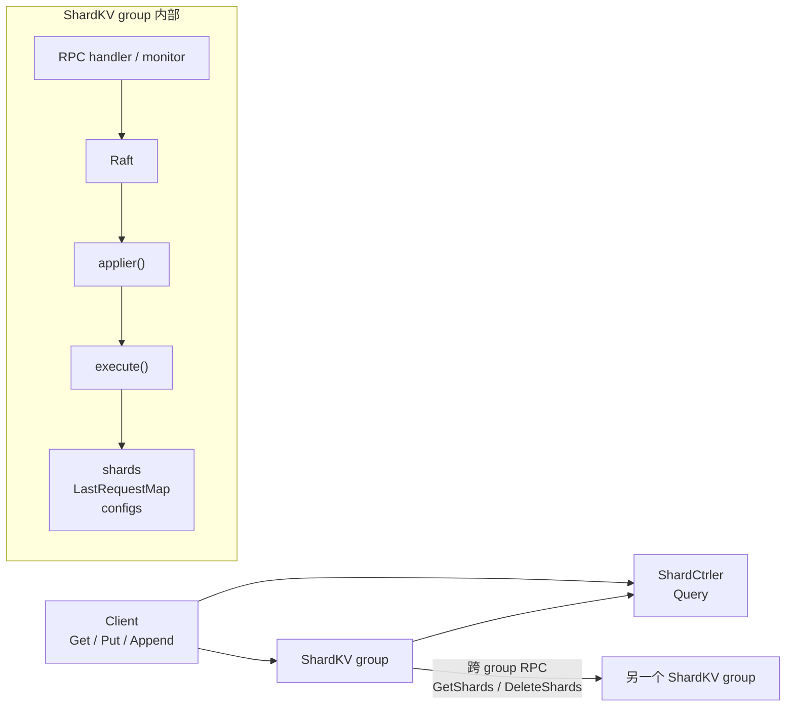
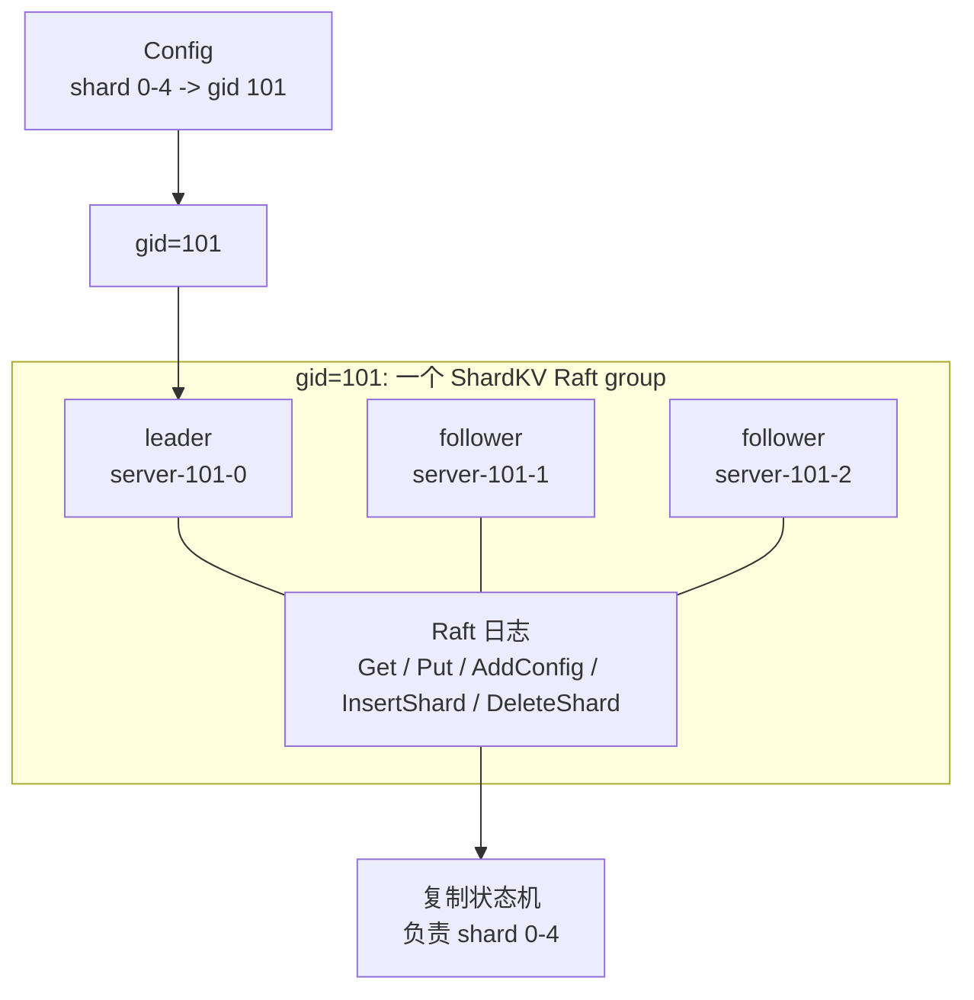
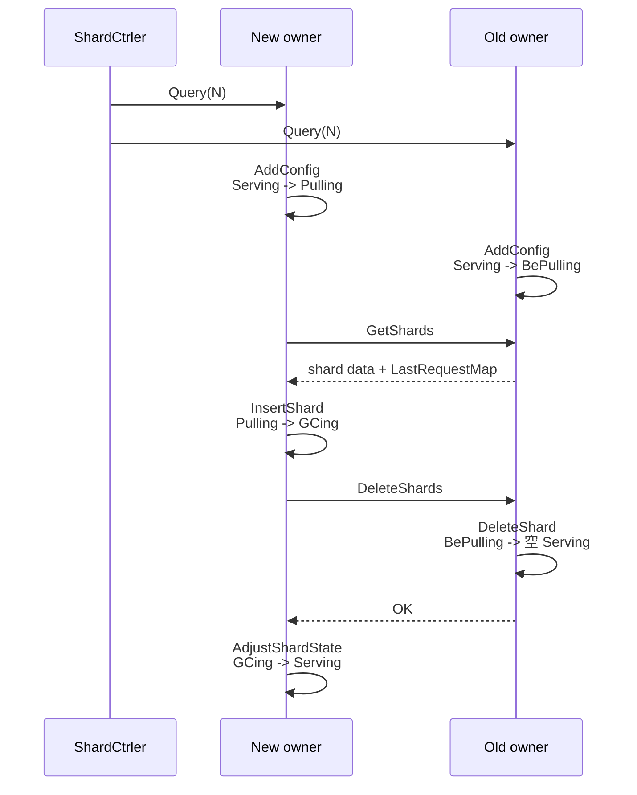
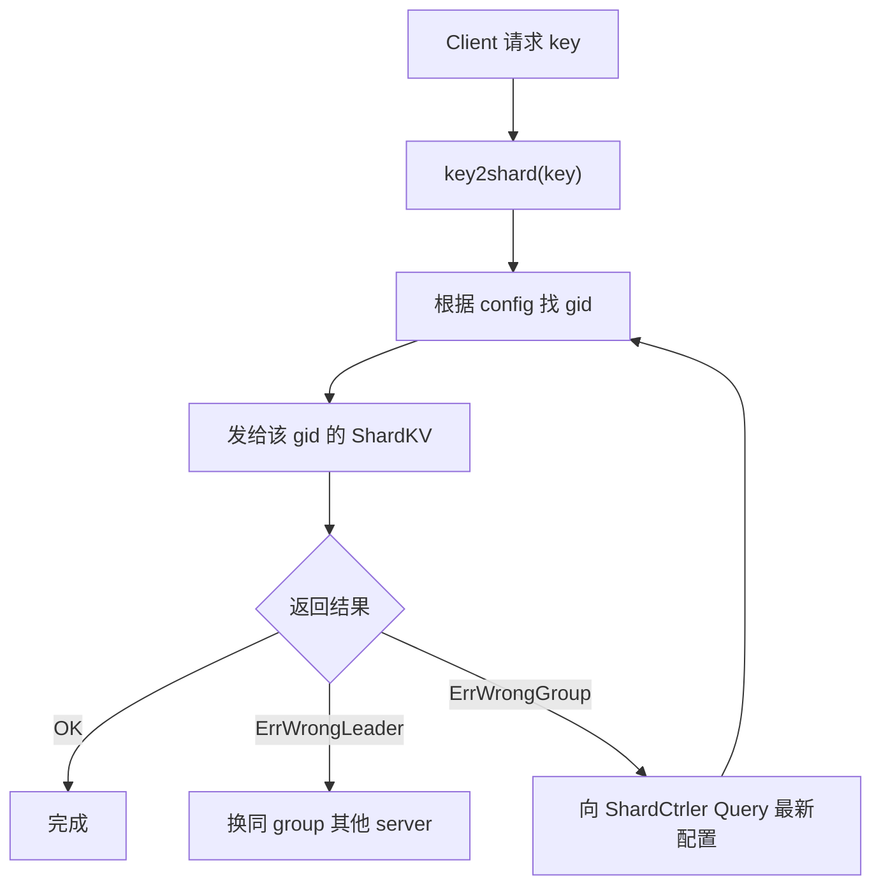
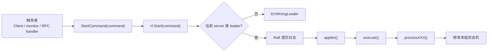
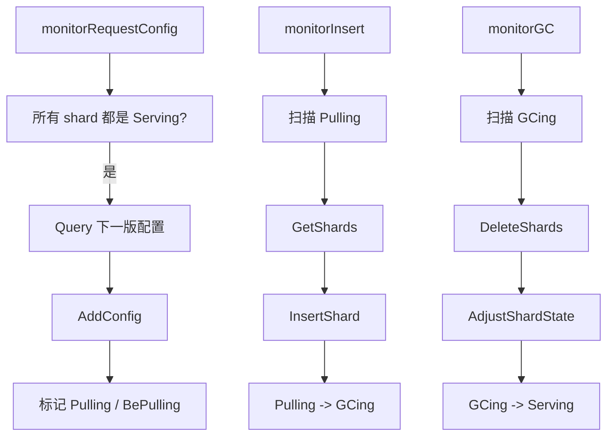
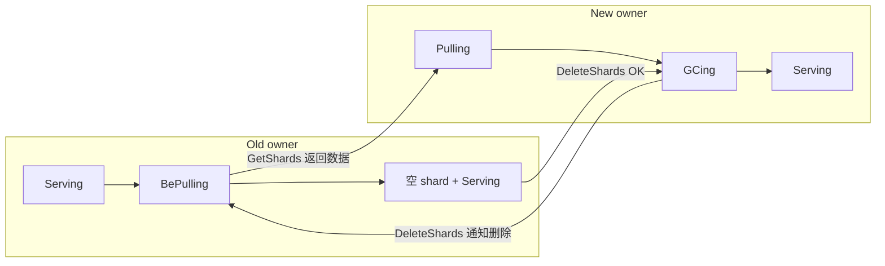

# Lab5B ShardKV 角色与操作表

一句话主线：

```text
配置变化 -> new owner 拉 shard -> old owner 删旧 shard -> new owner 收尾
```

## 整体架构



## Group 与 Raft

一个 ShardKV group 是一组 server，这组 server 内部跑一套 Raft，共同复制这个 group 负责的 shard 数据。

```text
gid=101
  server-101-0
  server-101-1
  server-101-2

这三个 server 是一个 Raft group。
如果 config 里 shard 0-4 属于 gid=101，
那么 shard 0-4 的数据会在这个 Raft group 内复制。
```





## 核心规则

| 规则 | 重点 |
| --- | --- |
| shard 数量固定 | Lab5 固定 `NShards = 10`，配置变化只改变 `shard -> gid`。 |
| 状态变更必须走 Raft | 只要会改 `shards`、`LastRequestMap`、`currentConfig`，都要变成 Raft command。 |
| 配置一版一版推进 | 只取 `currentConfig.Num + 1`，不能跳配置。 |
| 迁移没完成不取新配置 | 只要有 shard 不是 `Serving`，`monitorRequestConfig` 就不会继续拉下一版。 |
| RPC 可以打到 follower | 但只有 leader 能 `StartCommand` 成功。 |

固定分片的意思是：

```text
ShardCtrler 不会新增 shard，也不会删除 shard。
ShardKV 只负责把已有 shard 的数据从 old owner 搬到 new owner。
```

## 三类组件能做什么

### Client

| 操作 | 发给谁 | 作用 |
| --- | --- | --- |
| `Query` | ShardCtrler | 拉配置，知道每个 shard 属于哪个 gid。 |
| `Get` | ShardKV | 读 key。 |
| `Put` | ShardKV | 写 key。 |
| `Append` | ShardKV | 追加 key。 |

Client 只做普通读写和刷新配置，不参与 shard 迁移。



### ShardCtrler

| 操作 | 谁会调用 | 作用 |
| --- | --- | --- |
| `Join` | 测试/管理端 | 新 group 加入，生成新配置。 |
| `Leave` | 测试/管理端 | group 离开，生成新配置。 |
| `Move` | 测试/管理端 | 手动把某个 shard 移到指定 gid，生成新配置。 |
| `Query` | Client / ShardKV | 返回指定配置或最新配置。 |

`Join` 和 `Leave` 是 group 级别的配置变更：它们先改变 `Config.Groups` 里的 gid 集合，再由 ShardCtrler 重新计算 `Config.Shards`，让 shard 在剩余 group 之间尽量均衡。`Move` 是 shard 级别的手动调整：它不加入或删除 group，只把某一个 `shard` 的 owner 改成指定 `gid`，因此不会触发整体 rebalance。`Query` 只是读取配置，不生成新配置。

换句话说，测试/管理端负责发出 `Join`、`Leave`、`Move` 这种控制面命令；ShardKV group 不自己决定加入或离开集群，它只会周期性 `Query` 下一版配置，然后按配置迁移 shard。

ShardCtrler 只管理配置，不保存 KV 数据，也不迁移 shard 数据。

### ShardKV

| 操作 | 谁触发 | 作用 |
| --- | --- | --- |
| `Get` / `PutAppend` | Client | 处理普通 KV 请求。 |
| `AddConfig` | `monitorRequestConfig` | 应用下一版配置，标记 `Pulling` / `BePulling`。 |
| `GetShards` | new owner 的 `monitorInsert` 调 old owner | old owner 返回 shard 数据。 |
| `InsertShard` | new owner 的 `monitorInsert` | new owner 安装拉来的 shard 数据。 |
| `DeleteShards` | new owner 的 `monitorGC` 调 old owner | old owner 删除旧 shard 数据。 |
| `AdjustShardState` | new owner 的 `monitorGC` | new owner 从 `GCing` 收尾到 `Serving`。 |

ShardKV 既处理客户端读写，也负责 shard 迁移；凡是改本组状态的操作都要进本组 Raft。

## Command 触发表

所有会修改 ShardKV 本组状态的操作，都会走同一条 Raft 路径：



| CommandType | 谁触发 | 进入谁的 Raft | 作用 |
| --- | --- | --- | --- |
| `Get` | Client | 当前 shard owner | 读数据。 |
| `Put` / `Append` | Client | 当前 shard owner | 写数据，更新去重表。 |
| `AddConfig` | `monitorRequestConfig` | 本 group | 应用下一版配置，标记 `Pulling` / `BePulling`。 |
| `InsertShard` | new owner 的 `monitorInsert` | new owner | 安装拉来的数据，`Pulling -> GCing`。 |
| `DeleteShard` | old owner 收到 `DeleteShards` 后 | old owner | 删除旧数据，`BePulling -> 空 Serving`。 |
| `AdjustShardState` | new owner 的 `monitorGC` | new owner | 旧副本已删，`GCing -> Serving`。 |

## Monitor 做什么

三个 monitor 的分工：



| Monitor | 扫描什么 | 发什么请求 | 提交什么 command |
| --- | --- | --- | --- |
| `monitorRequestConfig` | 是否所有 shard 都是 `Serving` | `Query(currentConfig.Num + 1)` | `AddConfig` |
| `monitorInsert` | `Pulling` shard | 向 old owner 发 `GetShards` | `InsertShard` |
| `monitorGC` | `GCing` shard | 向 old owner 发 `DeleteShards` | `AdjustShardState` |

## Shard 状态

| 状态 | 在谁那里 | 能否服务客户端 | 含义 |
| --- | --- | --- | --- |
| `Serving` | 当前 owner 或无迁移任务的 group | 当前配置属于本 gid 时可以 | 正常状态。 |
| `Pulling` | new owner | 不能 | 我是新 owner，但还没拿到数据。 |
| `BePulling` | old owner | 不能 | 我不是 owner 了，但先保留数据给新 owner 拉。 |
| `GCing` | new owner | 可以 | 我已经有数据，但 old owner 还没删旧副本。 |



## 一次迁移链路

| 步骤 | 动作 | 结果 |
| --- | --- | --- |
| 1 | 各 group 应用 `AddConfig` | old owner: `Serving -> BePulling`；new owner: `Serving -> Pulling`。 |
| 2 | new owner 调 old owner 的 `GetShards` | old owner 返回 shard 数据和 `LastRequestMap`。 |
| 3 | new owner 提交 `InsertShard` | new owner: `Pulling -> GCing`。 |
| 4 | new owner 调 old owner 的 `DeleteShards` | old owner 提交 `DeleteShard`，清空旧数据。 |
| 5 | new owner 提交 `AdjustShardState` | new owner: `GCing -> Serving`，迁移结束。 |

## 读代码顺序

```text
monitorRequestConfig -> processAddConfig
monitorInsert        -> GetShards -> processInsertShard
monitorGC            -> DeleteShards -> processDeleteShard
monitorGC            -> processAdjustGCingShard
```
